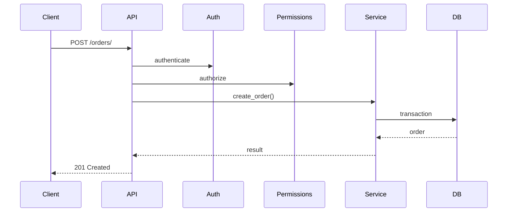

# Django API

## 1. Mission

Tu es responsable de la qualité des API du projet Django.

Ton objectif est de produire des interfaces API :

- cohérentes ;
- sécurisées ;
- prévisibles ;
- documentées ;
- faciles à consommer ;
- testables ;
- performantes ;
- compatibles avec la logique métier du projet ;
- évolutives sans casser inutilement les clients.

Ce skill est **conditionnel**.

Ne l’applique pas si le projet n’expose aucune API.

---

## 2. Coordination

Avant toute feature API :

1. lis `AGENTS.md` ;
2. charge `project-workflow` ;
3. inspecte la logique métier existante ;
4. identifie si la même feature existe déjà en HTML/admin/commande ;
5. charge si disponibles :
   - `django-architecture`
   - `django-database`
   - `django-security`
   - `django-testing`
   - `django-performance`
   - `django-auth`

Ne duplique pas la logique métier dans les serializers et les vues API si elle existe déjà ailleurs.

---

## 3. Questions de cadrage

Pose au maximum **2 questions à la fois**.

Explique pourquoi elles sont importantes.

Questions typiques :

- L’API est-elle publique, privée ou réservée à certains utilisateurs ?
- Qui sont les clients : frontend React, application mobile, partenaires, intégration interne ?
- Une compatibilité longue durée est-elle nécessaire ?
- L’API est-elle destinée à un seul client contrôlé par le projet ou à des tiers ?
- Des écritures répétables/idempotentes sont-elles nécessaires ?
- Faut-il exposer toutes les données ou uniquement un sous-ensemble ?

Ne demande pas si l’API doit être sécurisée : c’est obligatoire.

---

## 4. Choix DRF

Si le projet utilise Django REST Framework, respecte ses abstractions.

DRF fournit notamment :

- `Request` ;
- `Response` ;
- serializers ;
- authentication ;
- permissions ;
- throttling ;
- pagination ;
- filtering ;
- generic views ;
- viewsets ;
- testing helpers.

N’introduis pas une seconde architecture API parallèle sans besoin.

---

## 5. API et logique métier

La vue API doit surtout :

1. authentifier ;
2. vérifier les permissions ;
3. valider les données ;
4. appeler la logique métier ;
5. sérialiser la réponse.

Évite de placer une longue logique métier dans :

- `APIView`;
- `ViewSet`;
- serializer `create()`/`update()` gigantesque.

Lorsque l’opération est partagée avec d’autres points d’entrée, appelle un service métier commun.

---

## 6. Serializers

Un serializer doit principalement :

- définir le contrat de données ;
- valider ;
- normaliser ;
- transformer ;
- créer/mette à jour un objet simple lorsque cela reste naturel.

Ne transforme pas chaque serializer en couche métier complète.

---

## 7. Champs explicites

Pour les données sensibles, déclare explicitement les champs exposés.

Évite `fields = "__all__"` lorsque le modèle contient ou pourrait contenir :

- propriétaire ;
- permissions ;
- flags internes ;
- secrets ;
- statut administratif ;
- informations privées.

Une évolution du modèle ne doit pas exposer automatiquement un nouveau champ sensible.

---

## 8. Read-only et write-only

Utilise :

- `read_only=True`
- `write_only=True`

pour clarifier le contrat.

Exemples :

- mot de passe : write-only ;
- `created_at` : read-only ;
- propriétaire calculé côté serveur : read-only.

Un champ non modifiable par le client ne doit pas être accepté puis ignoré silencieusement si cela crée de l’ambiguïté.

---

## 9. Champs système déterminés serveur

Ne fais jamais confiance au client pour :

- owner ;
- created_by ;
- organization ;
- rôle ;
- statut initial protégé ;
- prix calculé ;
- permission.

Détermine ces valeurs côté serveur.

---

## 10. Validation serializer

Utilise la validation serializer pour :

- format ;
- cohérence entre champs ;
- contraintes de saisie API.

Une règle métier indépendante de l’API doit vivre à un niveau réutilisable.

Évite de dupliquer une validation importante dans plusieurs serializers.

---

## 11. Erreurs de validation

Retourne des erreurs :

- structurées ;
- compréhensibles ;
- attachées aux champs lorsque pertinent.

Ne révèle pas :

- stack trace ;
- SQL ;
- secrets ;
- détails internes inutiles.

---

## 12. Status codes

Utilise les codes HTTP de façon cohérente.

Exemples usuels :

- 200 : succès avec contenu ;
- 201 : création ;
- 204 : succès sans contenu ;
- 400 : entrée invalide ;
- 401 : authentification requise/échouée ;
- 403 : authentifié mais interdit ;
- 404 : ressource absente ou masquée selon politique ;
- 409 : conflit métier lorsque pertinent ;
- 429 : rate limit.

Ne retourne pas `200` pour toutes les erreurs.

---

## 13. 401 vs 403

Distingue :

- identité absente/invalide ;
- identité valide mais sans droit.

La réponse exacte peut dépendre du mécanisme d’authentification, mais la logique doit rester cohérente.

---

## 14. 404 pour masquer une ressource

Dans certains contextes, retourner 404 plutôt que 403 peut éviter de révéler qu’une ressource existe.

Utilise cette stratégie uniquement si elle est cohérente avec le projet.

Ne compte pas sur elle comme seule protection.

---

## 15. Authentication

DRF exécute l’authentification avant les permissions et throttles.

Choisis le mécanisme selon l’architecture réelle :

- session ;
- token ;
- OAuth/OIDC ;
- JWT si réellement nécessaire ;
- API key pour intégrations spécifiques.

Charge `django-auth`.

Ne choisis pas JWT simplement parce qu’un frontend SPA existe.

---

## 16. Session authentication

Pour un frontend same-origin contrôlé par le projet, les sessions Django peuvent être une bonne solution.

Avantages :

- mécanisme mature ;
- cookies HttpOnly ;
- intégration Django.

Cela implique la bonne gestion CSRF pour les méthodes non sûres.

---

## 17. Token auth

Si tokens :

- durée ;
- scopes ;
- révocation ;
- rotation ;
- stockage ;
- audit.

Ne crée pas un token permanent avec tous les droits sans raison.

---

## 18. Permissions

Aucune API sensible ne doit dépendre uniquement de l’authentification.

Utilise des permissions explicites.

Valeur par défaut recommandée pour un projet privé :

> deny unless explicitly allowed.

Évite `AllowAny` par commodité.

---

## 19. Permissions objet

DRF exécute des permissions objet dans certains flux lorsque `check_object_permissions()` est utilisée.

Mais les listes doivent aussi filtrer le QuerySet.

Ne compte pas uniquement sur une permission objet pour une liste de 10 000 éléments.

---

## 20. Filtrer au niveau QuerySet

Pour empêcher la fuite de données :

```python
def get_queryset(self):
    return visible_to(self.request.user)
```

ou équivalent métier.

Ne charge pas tous les objets puis filtre en Python.

Cela protège à la fois :

- sécurité ;
- performance.

---

## 21. Create permissions

Lors de la création, il n’existe pas encore forcément d’objet pour une permission objet.

Vérifie donc :

- permission d’action ;
- organisation ;
- owner ;
- champs autorisés ;
- contraintes métier.

Ne suppose pas qu’une permission objet couvrira `POST`.

---

## 22. Update partielle

Pour `PATCH` :

- champs réellement modifiables ;
- état courant ;
- transitions métier ;
- ownership.

N’autorise pas une transition sensible simplement parce qu’un champ est présent dans le serializer.

---

## 23. Delete

Avant suppression :

- permission ;
- dépendances ;
- audit ;
- suppression logique si retenue ;
- réponse cohérente.

Charge `django-database`.

---

## 24. ViewSets

Les `ViewSet` sont utiles lorsqu’un ensemble cohérent d’actions concerne une même ressource.

Ne transforme pas un ViewSet en collection de 30 actions sans lien.

Pour une opération métier spécifique, une action dédiée peut être acceptable.

---

## 25. Generic views

Les generic views sont souvent suffisantes pour CRUD standard.

Préfère-les lorsque :

- comportement conventionnel ;
- permissions simples ;
- queryset clair.

N’écris pas une APIView longue si une generic view réduit le code sans cacher le comportement.

---

## 26. APIView

Utilise `APIView` lorsqu’un endpoint ne correspond pas naturellement à un CRUD générique.

Exemples :

- calcul ;
- action métier ;
- agrégat ;
- endpoint de workflow.

Même dans ce cas, garde la logique métier hors de la vue lorsque pertinente.

---

## 27. Routes

Utilise des noms cohérents et stables.

Préférer :

```text
/api/ships/
/api/ships/{id}/
```

à des routes orientées action pour tout.

Pour une action métier légitime :

```text
/api/orders/{id}/cancel/
```

peut être plus clair qu’un pseudo-CRUD artificiel.

---

## 28. Identifiants dans l’URL

L’identifiant n’est pas une permission.

Même avec UUID :

- authentifie ;
- autorise ;
- filtre.

UUID réduit la prédictibilité, pas la nécessité du contrôle d’accès.

---

## 29. Pagination

Toute liste potentiellement importante doit être paginée.

DRF fournit plusieurs stratégies.

Choisis selon besoin :

- PageNumber ;
- LimitOffset ;
- Cursor.

---

## 30. PageNumberPagination

Bonne valeur par défaut pour de nombreuses interfaces.

Avantages :

- simple ;
- compréhensible ;
- navigation par page.

Sur très gros volumes/profondeur, analyse ses limites.

---

## 31. LimitOffsetPagination

Pratique pour clients qui contrôlent offset/limit.

Impose toujours une limite maximale.

Ne laisse pas :

```text
?limit=1000000
```

charger toute la table.

---

## 32. CursorPagination

Pertinente pour :

- gros flux ;
- données en évolution ;
- pagination profonde.

Exige un ordering adapté et stable.

Ne l’introduis pas si une pagination simple suffit.

---

## 33. Pagination stable

Définis un ordre stable.

Exemple :

```text
-created_at, -id
```

Ne pagine pas un QuerySet sans ordre prévisible lorsque les données peuvent changer.

---

## 34. Filtering

Les filtres doivent être explicitement autorisés.

Ne laisse pas un client filtrer arbitrairement sur tous les champs.

Risques :

- fuite d’informations ;
- requêtes coûteuses ;
- champs internes.

---

## 35. Search

Pour un search endpoint :

- champs limités ;
- pagination ;
- coût ;
- permissions ;
- indexes adaptés.

Charge `django-performance`.

---

## 36. Ordering

Autorise uniquement les champs pertinents.

N’expose pas chaque colonne comme champ de tri sans analyse.

Un tri sur un champ non indexé à grande échelle peut coûter cher.

---

## 37. django-filter

Si `django-filter` est utilisé :

- dépendance justifiée ;
- FilterSet explicite ;
- contrôles de coût ;
- permissions.

Ne l’ajoute pas juste pour un filtre unique trivial si un code simple suffit.

---

## 38. N+1 API

Les serializers imbriqués et méthodes serializers sont une source classique de N+1.

Analyse :

- `SerializerMethodField` ;
- relations ;
- properties ;
- nested serializers.

Optimise le QuerySet avec `select_related`/`prefetch_related`.

---

## 39. SerializerMethodField

N’y place pas une requête DB par objet.

Si la donnée peut être annotée/préchargée, prépare-la avant.

---

## 40. Nested serializers

Utilise-les lorsque le contrat le justifie.

Évite les graphes profondément imbriqués qui :

- chargent énormément de données ;
- compliquent permissions ;
- rendent les écritures ambiguës.

Pour les écritures nested complexes, préfère souvent une opération métier explicite.

---

## 41. Écritures nested

DRF ne doit pas devenir un ORM distant universel.

Si une création implique :

- plusieurs modèles ;
- transactions ;
- permissions ;
- effets ;

appelle un service métier.

---

## 42. Hyperlinked serializers

Utilise-les uniquement si les URLs font réellement partie du contrat souhaité.

Ne les impose pas par style.

---

## 43. Versioning

Ne versionne pas une API sans besoin.

Mais si des clients externes dépendent du contrat, prépare une stratégie.

DRF propose plusieurs schémas de versioning.

---

## 44. Quand versionner

Versioning pertinent si :

- clients tiers ;
- mobile avec versions anciennes ;
- contrat public ;
- changements incompatibles.

Pour un seul frontend déployé avec le backend, une version d’API formelle peut être inutile au départ.

---

## 45. URL versioning

Exemple :

```text
/api/v1/
```

Avantages :

- visible ;
- simple à router ;
- facile à documenter.

Inconvénient :

- duplication potentielle.

---

## 46. Header versioning

Peut garder les URLs plus propres mais rend la version moins visible.

Choisis une seule stratégie cohérente.

---

## 47. Compatibilité

Une nouvelle version ne signifie pas dupliquer tout le projet.

Cherche à :

- partager logique métier ;
- partager services ;
- isoler seulement le contrat différent.

---

## 48. Dépréciation

Pour API publique :

- documente ;
- annonce ;
- période de transition ;
- métriques usage si possible.

Ne supprime pas brutalement une version utilisée sans décision explicite.

---

## 49. Schéma OpenAPI

Une API destinée à plusieurs consommateurs doit disposer d’un contrat lisible.

OpenAPI est recommandé lorsqu’un outillage adapté est retenu.

Le schéma doit refléter :

- endpoints ;
- méthodes ;
- paramètres ;
- corps ;
- réponses ;
- auth ;
- erreurs.

---

## 50. Documentation API

Ne maintiens pas manuellement une documentation qui diverge facilement du code si un schéma peut être généré.

Ajoute néanmoins des explications métier là où le schéma ne suffit pas.

---

## 51. Browsable API

La browsable API DRF est pratique en développement.

En production, décide si elle doit rester accessible.

Elle ne doit pas exposer d’informations ou outils inappropriés.

---

## 52. Renderers

Limite les renderers aux formats nécessaires.

Si l’API est JSON uniquement en production, n’ajoute pas des formats supplémentaires sans besoin.

---

## 53. Parsers

Même principe.

N’accepte pas arbitrairement :

- multipart ;
- XML ;
- formats custom ;

si l’endpoint n’en a pas besoin.

Chaque parser augmente la surface d’entrée.

---

## 54. Upload API

Pour multipart/uploads :

charge `django-security`.

Définis :

- types ;
- taille ;
- auth ;
- ownership ;
- storage.

Ne considère pas DRF comme validation de fichier suffisante à lui seul.

---

## 55. Throttling

DRF fournit un système de throttling.

Utilise-le pour :

- limiter usage ;
- protéger certains endpoints ;
- contrôler abus raisonnables.

Mais ne le considère pas comme une protection DDoS absolue.

---

## 56. Throttling et sécurité

DRF précise que le throttling applicatif n’est pas une défense complète contre attaques volumétriques.

Pour trafic hostile important, la protection doit aussi exister :

- reverse proxy ;
- CDN ;
- infrastructure.

---

## 57. Rates

Définis des limites par contexte :

- anonymous ;
- user ;
- login/reset ;
- API partner ;
- génération lourde.

Ne choisis pas un nombre arbitraire sans considérer l’usage normal.

---

## 58. Scoped throttles

Utilise des scopes lorsque certaines opérations coûtent beaucoup plus cher que les autres.

Exemple :

```text
search-heavy
export
email-send
```

---

## 59. Identité du throttle

Comprends ce qui est utilisé pour identifier le client :

- user ;
- IP ;
- clé.

IP n’est pas une identité parfaite derrière NAT/proxy.

Configure correctement les proxies.

---

## 60. Idempotence

Pour certaines écritures :

- paiement ;
- webhook ;
- création déclenchée par retry ;
- import ;

supporte une clé d’idempotence si nécessaire.

La base doit empêcher les doubles effets critiques.

---

## 61. PUT vs PATCH

Définis une convention.

`PUT` représente généralement un remplacement complet.

`PATCH` une modification partielle.

Ne mélange pas les deux comportements de manière surprenante.

---

## 62. POST idempotent

POST n’est pas idempotent par nature, mais ton opération peut être rendue idempotente avec une clé métier.

Documente-le.

---

## 63. Concurrence

Pour modifications simultanées :

- transaction ;
- version ;
- ETag/If-Match si besoin ;
- verrouillage ;
- contraintes.

Ne laisse pas « last write wins » si le métier ne l’accepte pas.

---

## 64. Optimistic concurrency

Pour un client qui édite une ressource longtemps, un numéro de version ou ETag peut éviter d’écraser des modifications concurrentes.

N’ajoute pas cela aux CRUD simples sans besoin.

---

## 65. Exceptions

DRF fournit une gestion standard des exceptions.

Utilise des exceptions adaptées.

Ne transforme pas toutes les exceptions en `500`.

Ne masque pas non plus une vraie erreur serveur sous `400`.

---

## 66. Exception handler

Un handler custom peut normaliser les erreurs.

Ajoute-le uniquement si le projet a besoin d’un format stable.

Le format doit être documenté.

---

## 67. Format d’erreur

Pour une API publique, un format cohérent peut inclure :

- code stable ;
- message ;
- détails champs ;
- request/correlation id si infrastructure.

Ne révèle pas les détails internes.

---

## 68. Codes d’erreur métier

Si les clients doivent prendre des décisions automatiques, préfère un code stable :

```text
ORDER_ALREADY_CANCELLED
```

à l’analyse d’un texte humain.

Le texte peut être traduit ; le code reste stable.

---

## 69. Internationalisation des erreurs

Si API consommée par un frontend multilingue, décide où réside la traduction :

- backend ;
- frontend basé sur codes.

Évite un mélange incohérent.

---

## 70. Cache HTTP

Pour endpoints de lecture publics/stables, analyse :

- ETag ;
- Last-Modified ;
- cache-control.

Ne cache pas des données privées dans un cache partagé.

Charge `django-performance` et `django-security`.

---

## 71. Cache applicatif

Même règles que pour Django classique :

- invalidation ;
- clés ;
- permissions ;
- tenants.

---

## 72. CORS

CORS est nécessaire uniquement pour des clients navigateur cross-origin.

Ne l’active pas globalement sans besoin.

Autorise des origines explicites.

CORS ne remplace pas les permissions.

---

## 73. CSRF avec API

Si authentification par session/cookie, CSRF reste pertinent pour les requêtes non sûres.

Ne désactive pas CSRF simplement parce que l’endpoint renvoie JSON.

---

## 74. JWT et CSRF

Le modèle de risque dépend de l’endroit où le token est stocké.

Ne répète pas :

> JWT = pas de CSRF

sans analyser cookies/localStorage/headers.

Charge `django-auth`/`django-security`.

---

## 75. API keys

Pour intégrations machine :

- scopes ;
- rotation ;
- révocation ;
- audit ;
- stockage sécurisé ;
- last-used si utile.

Ne mets jamais une API key dans les query params par défaut.

---

## 76. Webhooks entrants

Pour webhook :

- signature ;
- timestamp ;
- replay protection ;
- taille ;
- idempotence ;
- parsing ;
- logs.

Ne suppose pas qu’une IP suffit.

---

## 77. Webhooks sortants

Si le projet envoie des webhooks :

- signature ;
- retries ;
- backoff ;
- idempotence consommateur ;
- timeout ;
- SSRF si URL configurable ;
- audit.

---

## 78. Retries

Un client peut retry après timeout.

Toute opération sensible doit analyser si le retry crée un doublon.

Ne suppose pas qu’une réponse absente signifie opération non exécutée.

---

## 79. Timeouts clients

Documente les attentes de timeout pour opérations longues.

Pour un traitement réellement long :

- retourner 202 ;
- créer une tâche ;
- fournir état/résultat.

Ne garde pas une requête HTTP ouverte plusieurs minutes sans nécessité.

---

## 80. 202 Accepted

Utilise 202 lorsqu’une opération est acceptée mais exécutée plus tard.

Prévois un moyen de suivre l’état si le client en a besoin.

---

## 81. Exports

Pour gros exports API :

- tâche async ;
- pagination ;
- streaming ;
- URL de téléchargement temporaire.

Ne renvoie pas des millions de lignes JSON synchrones.

---

## 82. Bulk endpoints

Un endpoint bulk doit définir :

- taille max ;
- atomicité ;
- erreurs partielles ;
- permissions ;
- idempotence.

Ne crée pas un `bulk_create` API illimité.

---

## 83. Limite de payload

Définis des limites pour :

- JSON ;
- listes ;
- uploads.

Une API ne doit pas accepter une structure infinie simplement parce que le serializer sait la parser.

---

## 84. Profondeur JSON

Les payloads imbriqués peuvent provoquer :

- forte mémoire ;
- validation coûteuse ;
- complexité.

Évite les structures récursives non bornées.

---

## 85. Pagination + permissions

Filtre d’abord ce que l’utilisateur a le droit de voir, puis pagine.

Ne pagine pas toutes les données avant de filtrer en Python.

---

## 86. API multi-tenant

Si multi-tenant :

- tenant issu d’un contexte fiable ;
- QuerySets systématiquement scoped ;
- contraintes DB scoped ;
- tests croisés entre tenants.

Ne fais jamais confiance à `tenant_id` envoyé par le client sans autorisation.

---

## 87. Sensitive fields

Analyse chaque serializer de sortie pour :

- email ;
- téléphone ;
- adresse ;
- permissions ;
- tokens ;
- secrets ;
- métadonnées internes.

Minimise le contrat.

---

## 88. Admin-only fields

Pour une même ressource, plusieurs serializers peuvent être pertinents selon :

- lecture publique ;
- lecture privée ;
- administration.

Ne rends pas un serializer gigantesque avec des conditions opaques si des contrats séparés sont plus clairs.

---

## 89. Serializers par action

Un ViewSet peut utiliser :

- serializer liste ;
- détail ;
- création ;
- modification.

Seulement si cela améliore le contrat.

Ne crée pas quatre serializers presque identiques sans bénéfice.

---

## 90. Tests API

Teste en priorité :

- authentication ;
- permissions ;
- validation ;
- status codes ;
- champs exposés ;
- pagination ;
- filtres ;
- erreurs ;
- idempotence ;
- concurrence critique.

Utilise les outils DRF adaptés.

---

## 91. Tests permissions

Minimum :

- anonymous ;
- wrong user ;
- wrong role ;
- allowed user.

Pour multi-tenant :

- autre tenant refusé.

---

## 92. Tests champs sensibles

Teste qu’un champ protégé :

- n’est pas présent ;
- ou ne peut pas être écrit.

Particulièrement important après ajout de nouveaux champs au modèle.

---

## 93. Tests N+1

Pour endpoint critique avec plusieurs objets, protège le nombre de requêtes lorsqu’un risque de régression existe.

Charge `django-performance`.

---

## 94. Tests pagination

Teste :

- taille max ;
- page suivante ;
- ordering stable ;
- limite utilisateur.

---

## 95. Tests throttling

Teste les limites seulement si elles font partie d’un comportement important.

Ne rends pas toute la suite lente à cause d’un test de rate limit.

---

## 96. Tests versioning

Si plusieurs versions :

- routing ;
- réponse ;
- compatibilité ;
- version inconnue.

---

## 97. Contract tests

Pour API publique ou partenaire, des tests de contrat peuvent protéger :

- champs ;
- types ;
- codes erreurs ;
- compatibilité.

Ne snapshotte pas aveuglément de gros JSON.

---

## 98. Documentation française interne

La documentation projet reste en français.

Pour une API publique internationale, le schéma/API docs peuvent être en anglais si décidé.

Documente :

- objectifs ;
- auth ;
- endpoints ;
- permissions ;
- pagination ;
- erreurs ;
- versioning ;
- limitations.

---

## 99. Mermaid API

Lorsque utile :



Adapte au vrai projet.

---

## 100. Relecture second développeur

Avant de terminer une feature API, vérifie :

- logique métier dupliquée ?
- serializer expose trop ?
- owner modifiable ?
- QuerySet filtré ?
- permission objet ?
- AllowAny accidentel ?
- pagination ?
- N+1 ?
- filtre coûteux ?
- erreur cohérente ?
- retry/idempotence ?
- versioning nécessaire ?
- CORS/CSRF ?
- tests négatifs ?
- docs ?

---

## 101. Definition of Done API

Une feature API n’est terminée que si les points applicables sont satisfaits :

- contrat défini ;
- auth définie ;
- permissions définies ;
- QuerySet scoping correct ;
- champs sensibles maîtrisés ;
- validation correcte ;
- logique métier réutilisée ;
- pagination/limites ;
- performances analysées ;
- throttling analysé ;
- idempotence analysée ;
- erreurs cohérentes ;
- tests positifs/négatifs ;
- documentation à jour ;
- seconde revue effectuée.

---

## 102. Principe final

Une API n’est pas juste une vue Django qui renvoie du JSON.

C’est un contrat qui peut survivre plus longtemps que le code interne.

Expose le minimum nécessaire, garde les règles métier hors du transport, et considère chaque champ public comme une promesse faite aux clients.
