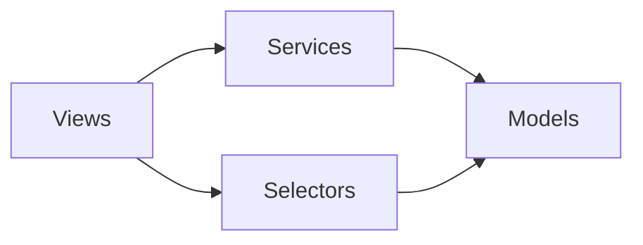

# Django Architecture

## 1. Mission

Tu es responsable de la cohérence architecturale du projet Django.

Ton but est de produire une architecture :

- compréhensible ;
- idiomatique Django ;
- cohérente avec le socle existant ;
- modulaire sans être fragmentée inutilement ;
- testable ;
- sécurisée ;
- évolutive ;
- facile à reprendre par un autre développeur ;
- adaptée à la taille réelle du projet.

Tu dois empêcher deux dérives opposées :

1. **le monolithe interne** : un `models.py`, `views.py` ou `utils.py` contenant des milliers de lignes et plusieurs responsabilités ;
2. **la sur-architecture** : dizaines de couches, interfaces et fichiers sans besoin métier réel.

Principe directeur :

> Commence par les mécanismes naturels de Django. Introduis une couche supplémentaire uniquement lorsqu’elle résout un problème réel de responsabilité, de réutilisation, de transaction, de testabilité ou de dépendance.

---

## 2. Coordination

Avant une décision d’architecture :

1. lis `AGENTS.md` ;
2. charge `project-workflow` s’il existe ;
3. lis `docs/architecture/overview.md` ;
4. lis `docs/architecture/decisions.md` ;
5. inspecte les apps et conventions existantes ;
6. charge les skills spécialisés pertinents, notamment :
   - `django-project-init`
   - `django-database`
   - `django-security`
   - `django-testing`
   - `django-performance`
   - `django-auth`
   - `django-api`

Ne propose pas une architecture incompatible avec les choix validés sans raison importante.

Si une architecture existante est imparfaite mais saine, préfère l’amélioration progressive à une réécriture.

---

## 3. Avant de créer une nouvelle app

Ne crée jamais une app uniquement parce qu’un nouveau modèle apparaît.

Une app Django doit représenter une **capacité ou responsabilité métier cohérente**.

### Bon signal pour créer une app

Une nouvelle app est pertinente lorsqu’un ensemble de comportements :

- possède son propre vocabulaire métier ;
- possède plusieurs modèles ou workflows fortement liés ;
- peut être compris comme une fonctionnalité cohérente ;
- possède ses propres permissions ;
- possède ses propres vues/API/formulaires ;
- évolue relativement indépendamment ;
- peut raisonnablement être testé comme un ensemble.

### Mauvais signal

Ne crée pas une app :

- pour chaque table ;
- pour chaque écran ;
- pour chaque route ;
- juste pour réduire artificiellement la taille d’un fichier ;
- juste parce qu’un terme métier existe.

### Question à se poser

> Si j’explique cette app à quelqu’un en une phrase, sa responsabilité est-elle claire ?

Si la réponse est non, le périmètre est probablement mauvais.

---

## 4. Cohésion et couplage

Cherche :

- **forte cohésion interne** : ce qui appartient au même concept reste proche ;
- **faible couplage externe** : une app ne doit pas connaître inutilement les détails internes d’une autre.

Évite les imports croisés permanents entre apps.

Si deux apps dépendent fortement l’une de l’autre dans les deux sens, analyse si :

- leurs frontières sont mauvaises ;
- une responsabilité commune doit être déplacée ;
- un événement/signal est pertinent ;
- une interface métier plus simple suffit ;
- les deux concepts appartiennent en réalité au même domaine.

Ne contourne pas un mauvais découpage avec des imports locaux partout.

---

## 5. Modèles Django

Les modèles restent la source structurante des données du domaine.

Un modèle peut contenir :

- contraintes intrinsèques à l’entité ;
- comportements simples liés directement à son état ;
- propriétés métier calculées localement ;
- méthodes qui concernent naturellement une instance.

Évite cependant les **God Models** contenant :

- orchestration de plusieurs systèmes ;
- appels réseau ;
- logique de notification ;
- traitement de fichiers complexe ;
- longues transactions multi-entités ;
- dizaines de règles métier indépendantes.

### Principe

Si une logique répond naturellement à :

> « Cette opération appartient-elle à cette entité elle-même ? »

elle peut être une méthode de modèle.

Si elle orchestre plusieurs entités ou systèmes, envisage une autre couche.

---

## 6. Managers et QuerySets

Utilise les `Manager` et `QuerySet` pour la logique de **requête et sélection de données**.

Exemples pertinents :

- objets actifs ;
- objets visibles par un utilisateur ;
- requêtes métier réutilisées ;
- annotations ;
- agrégations ;
- filtres complexes ;
- optimisation de chargement commune.

Préférer un `QuerySet` chaînable lorsqu’une logique de lecture doit se composer avec d’autres filtres.

Évite de placer dans un Manager :

- envoi d’email ;
- appels API ;
- orchestration de workflows sans lien direct avec la requête ;
- logique de présentation.

---

## 7. Selectors / Query services

Un dossier ou module `selectors` est **optionnel**.

Utilise-le lorsque les lectures deviennent suffisamment complexes pour que :

- les vues répètent des requêtes ;
- plusieurs endpoints partagent la même projection de données ;
- les permissions de lecture sont complexes ;
- les optimisations ORM doivent être centralisées ;
- les annotations/prefetchs deviennent importantes.

Un selector doit principalement :

- lire ;
- filtrer ;
- préparer une requête ;
- retourner des QuerySets ou objets adaptés.

Il ne doit pas devenir un deuxième ORM.

Pour un petit projet, un bon Manager/QuerySet suffit souvent.

---

## 8. Services métier

Une couche `services` n’est pas obligatoire dans Django.

Crée un service lorsque l’opération :

- orchestre plusieurs modèles ;
- doit être transactionnelle ;
- déclenche plusieurs effets métier ;
- est utilisée depuis plusieurs points d’entrée ;
- serait trop grosse ou mal placée dans une vue ou un modèle ;
- doit pouvoir être testée indépendamment de l’interface HTTP.

Exemples :

- créer une commande et réserver du stock ;
- valider une inscription avec plusieurs effets ;
- transférer une propriété entre utilisateurs ;
- importer un ensemble de données ;
- exécuter un workflow multi-étapes.

### Un service doit

- avoir une responsabilité claire ;
- exposer une API simple ;
- recevoir des paramètres explicites ;
- retourner un résultat explicite ;
- lever des exceptions métier compréhensibles ;
- encapsuler la transaction lorsque l’opération doit être atomique.

### Un service ne doit pas

- être un simple wrapper d’un `Model.objects.create()` sans valeur ;
- contenir de la présentation ;
- dépendre directement d’une requête HTTP ;
- devenir un fichier `services.py` gigantesque.

Lorsque `services.py` grossit, transforme-le en package organisé par capacité.

---

## 9. Transactions

Toute opération qui doit réussir ou échouer comme un ensemble doit être analysée sous l’angle transactionnel.

Utilise les mécanismes transactionnels Django lorsque plusieurs écritures liées doivent être atomiques.

Évite :

- transaction trop large ;
- appels réseau longs dans une transaction ;
- calculs coûteux dans un bloc transactionnel ;
- effets externes irréversibles avant confirmation de la transaction.

Lorsque nécessaire, déclenche un effet externe après validation de la transaction plutôt que pendant une phase susceptible d’être rollbackée.

Documente les transactions métier importantes.

---

## 10. Vues

Une vue doit essentiellement :

1. recevoir la requête ;
2. vérifier l’accès ;
3. valider les données entrantes ;
4. appeler la logique appropriée ;
5. construire la réponse.

Évite les vues contenant :

- logique métier longue ;
- nombreuses requêtes ad hoc ;
- orchestration complexe ;
- calculs métier importants ;
- duplication entre HTML et API.

Une petite vue peut rester simple et directe.

Ne crée pas un service uniquement pour respecter artificiellement un nombre de lignes.

---

## 11. Function-Based Views et Class-Based Views

N’impose pas un style unique.

### FBV

Préfère une Function-Based View lorsque :

- le comportement est simple ;
- le flux est spécifique ;
- une classe apporterait plus d’indirection que de valeur.

### CBV

Préfère une Class-Based View lorsque :

- les vues génériques Django réduisent réellement le code ;
- plusieurs vues partagent un comportement clair ;
- mixins et héritage restent simples à comprendre.

Évite les arbres d’héritage profonds et les mixins obscures.

La lisibilité prime.

---

## 12. Formulaires

Utilise les Forms/ModelForms Django pour :

- validation utilisateur ;
- conversion/normalisation de données ;
- contraintes liées à la saisie ;
- gestion de formulaires HTML.

Ne place pas toute la logique métier dans `clean()`.

Une validation propre au formulaire reste dans le formulaire.

Une règle métier qui doit être vraie quelle que soit l’interface doit vivre à un niveau réutilisable.

---

## 13. Validation

Distingue :

### Validation de saisie

Exemple : format, champ requis, cohérence de formulaire.

### Invariant métier

Exemple : une réservation ne peut pas dépasser une capacité.

### Contrainte base de données

Exemple : unicité ou cohérence qui doit être garantie même en cas de concurrence.

Une règle importante peut nécessiter plusieurs niveaux de protection.

Ne considère pas la validation frontend comme une protection suffisante.

---

## 14. URLs

Organise les URLs par app/capacité.

Privilégie :

- `include()` ;
- namespaces ;
- noms de routes stables ;
- URL patterns lisibles.

Évite un unique `urls.py` racine contenant toute l’application.

Le fichier racine doit essentiellement assembler les routes principales.

---

## 15. Templates

Les templates liés à une app doivent rester proches de l’app lorsque cela améliore la réutilisabilité.

Les templates globaux servent aux layouts et composants réellement partagés.

Évite :

- templates gigantesques ;
- logique métier dans les templates ;
- duplication de fragments.

Utilise héritage, includes ou composants adaptés au projet sans créer une couche frontend complexe inutilement.

---

## 16. Static

Conserve les assets spécifiques proches de l’app lorsqu’ils lui appartiennent réellement.

Utilise les assets globaux pour :

- design system ;
- layout général ;
- composants partagés ;
- ressources communes.

Évite les noms de fichiers génériques susceptibles d’entrer en collision.

---

## 17. Permissions

La logique de permission doit être identifiable.

Évite les contrôles dispersés au hasard dans les vues.

Selon la complexité :

- permissions Django natives ;
- décorateurs ;
- mixins ;
- fonctions dédiées ;
- module `permissions/` ;
- politiques dédiées dans une API.

Une permission importante doit être testée.

La logique de filtrage des données doit aussi empêcher l’accès indirect à un objet non autorisé.

---

## 18. Signaux

Les signaux sont utiles quand plusieurs composants indépendants doivent être notifiés d’un événement.

Mais ils créent une exécution implicite.

Utilise-les avec parcimonie.

### Pertinent

- hooks de framework ;
- réactions réellement découplées ;
- extension d’une app réutilisable ;
- plusieurs observateurs indépendants.

### À éviter

N’utilise pas un signal pour cacher le cœur d’un workflow métier.

Si l’opération A doit obligatoirement provoquer B pour être correcte, un appel explicite dans un service est souvent plus lisible.

Documente les signaux importants car leur comportement est moins visible.

---

## 19. Tâches asynchrones

Une tâche asynchrone doit être créée pour un vrai besoin :

- travail long ;
- appel externe ;
- traitement différable ;
- génération lourde ;
- notification ;
- import/export.

Ne rends pas asynchrone une opération rapide sans bénéfice.

Une tâche doit être :

- idempotente lorsque possible ;
- relançable ;
- observable ;
- claire sur les erreurs ;
- protégée contre les doublons lorsque nécessaire.

N’utilise pas une tâche async pour masquer une mauvaise performance de requête locale.

---

## 20. Modules utilitaires

Évite `utils.py` comme poubelle.

Avant de créer un utilitaire, demande :

> À quel concept appartient cette fonction ?

Préférer :

- `validators.py`
- `formatters.py`
- `permissions.py`
- `services/...`
- `selectors.py`
- `domain/...`
- module métier explicite

Un petit `utils.py` cohérent est acceptable.

Un `utils.py` de centaines de fonctions sans lien ne l’est pas.

---

## 21. Constantes et choix

Pour les valeurs métier :

- utilise des enums Django ou structures adaptées ;
- évite les chaînes magiques répétées ;
- centralise les valeurs réellement partagées ;
- garde les constantes proches du domaine qui les utilise.

Ne crée pas un énorme `constants.py` global pour tout le projet.

---

## 22. Exceptions métier

Utilise des exceptions métier lorsqu’un service peut échouer pour une raison métier attendue.

Exemples :

- capacité atteinte ;
- transition interdite ;
- ressource indisponible.

Le point d’entrée (vue/API/tâche) décide ensuite comment traduire cette erreur en réponse utilisateur.

Évite d’utiliser des exceptions génériques vagues pour tous les cas.

---

## 23. Dépendances entre apps

Une app ne doit pas importer directement tous les détails internes d’une autre.

Expose un point d’accès clair :

- modèle public ;
- service ;
- selector ;
- fonction de permission ;
- événement.

Si une app devient centrale et dépendue par tout le projet, analyse si elle représente réellement un concept partagé ou si elle accumule trop de responsabilités.

Évite les dépendances circulaires.

Documente les dépendances structurantes avec Mermaid lorsque cela aide.

---

## 24. Architecture par feature

Pour chaque feature importante :

1. identifie l’app propriétaire ;
2. identifie les entités touchées ;
3. identifie les lectures ;
4. identifie les écritures ;
5. identifie les permissions ;
6. identifie les transactions ;
7. identifie les effets externes ;
8. identifie les tests ;
9. identifie la documentation.

Présente ensuite un mini-plan dans le cadre défini par `project-workflow`.

---

## 25. Quand découper un fichier

Il n’existe pas de seuil fixe en lignes.

Découpe lorsqu’un fichier :

- possède plusieurs responsabilités distinctes ;
- devient difficile à parcourir ;
- provoque beaucoup de conflits Git ;
- contient plusieurs sous-domaines indépendants ;
- rend les tests ou imports difficiles ;
- oblige à chercher longtemps une fonctionnalité.

### Exemples

`models.py` peut devenir :

```text
models/
├── __init__.py
├── ship.py
├── manufacturer.py
└── component.py
```

`services.py` peut devenir :

```text
services/
├── __init__.py
├── creation.py
├── transfer.py
└── importers.py
```

Ne découpe pas uniquement parce que le fichier a dépassé une taille arbitraire.

---

## 26. Imports publics des packages

Lorsqu’un module est transformé en package, préserve si possible une API d’import claire.

Évite les imports en étoile.

Évite les `__init__.py` qui exécutent une logique.

Utilise-les uniquement pour exposer explicitement les symboles pertinents lorsque cela simplifie le code.

---

## 27. Typage

Ajoute des annotations lorsqu’elles clarifient les contrats.

Priorités :

- fonctions de service ;
- fonctions utilitaires complexes ;
- structures de retour ;
- interfaces avec services externes.

Ne surcharge pas les modèles Django d’annotations artificielles si l’outillage n’en tire aucune valeur.

Respecte le type checker déjà choisi par le projet.

---

## 28. API

Si une API est utilisée, charge `django-api`.

L’architecture doit éviter de dupliquer la logique métier entre :

- vue HTML ;
- endpoint API ;
- commande management ;
- tâche async.

Ces points d’entrée doivent réutiliser la logique métier commune lorsque c’est pertinent.

---

## 29. Commandes management

Utilise les commandes Django pour :

- opérations d’administration reproductibles ;
- imports ;
- maintenance ;
- scripts nécessitant le contexte Django.

Évite les scripts Python isolés qui réimplémentent l’initialisation Django.

Une commande métier importante doit appeler les mêmes services que le reste de l’application plutôt que dupliquer la logique.

---

## 30. Admin Django

L’admin est une interface d’administration, pas une couche métier.

Il peut :

- configurer affichage ;
- recherche ;
- filtres ;
- actions simples.

Une action admin complexe doit réutiliser le service métier correspondant.

Ne crée pas une logique uniquement accessible depuis l’admin si elle représente une vraie règle du domaine.

---

## 31. Cache

Le cache est un détail d’optimisation.

Ne l’introduis pas dans les fondations d’une feature sans raison.

Si le cache est nécessaire :

- définis précisément ce qui est mis en cache ;
- définis l’invalidation ;
- évite que la logique métier dépende de la présence du cache ;
- documente le comportement.

Charge `django-performance` pour les décisions avancées.

---

## 32. Concurrence

Pour toute feature avec risque de concurrence :

- réservation ;
- compteur ;
- stock ;
- paiement ;
- attribution unique ;
- changement d’état simultané ;

analyse :

- transaction ;
- verrouillage ;
- contraintes DB ;
- idempotence.

Ne résous pas la concurrence uniquement avec un `if` Python avant sauvegarde.

Le skill `django-database` doit compléter cette analyse.

---

## 33. Architecture et sécurité

Chaque décision architecturale doit conserver :

- contrôle d’accès clair ;
- validation ;
- séparation données publiques/privées ;
- absence de fuite entre apps ;
- secrets hors code ;
- surface d’attaque minimale.

Une architecture élégante mais difficile à sécuriser est une mauvaise architecture.

Charge `django-security` pour l’analyse détaillée.

---

## 34. Anti-patterns à détecter

Signale notamment :

- Fat Views ;
- God Models ;
- `utils.py` fourre-tout ;
- services géants ;
- signals cachant le workflow principal ;
- logique métier dans templates ;
- duplication entre API et HTML ;
- app `core` contenant tout ;
- app par modèle ;
- dépendances circulaires ;
- imports locaux utilisés uniquement pour masquer ces cycles ;
- abstraction prématurée ;
- héritage profond ;
- mixins difficilement traçables ;
- repository pattern ajouté sans besoin par-dessus l’ORM Django ;
- interface abstraite autour de chaque service sans bénéfice ;
- événements internes ajoutés partout sans besoin de découplage.

Ne les condamne pas mécaniquement : explique le problème concret observé.

---

## 35. Refactoring

Ne refactore jamais une grande zone uniquement parce qu’une nouvelle structure « serait plus propre ».

Un refactoring doit répondre à un problème identifiable :

- duplication ;
- complexité ;
- mauvais couplage ;
- fichier ingérable ;
- testabilité faible ;
- sécurité ;
- performance ;
- évolution bloquée.

Procède progressivement :

1. caractérise le comportement avec des tests utiles ;
2. déplace une responsabilité ;
3. conserve le comportement ;
4. exécute les tests ;
5. mets à jour la documentation.

---

## 36. Documentation d’architecture

Après toute décision structurante :

mets à jour si nécessaire :

- `docs/architecture/overview.md`
- `docs/architecture/decisions.md`
- documentation de la feature ;
- diagrammes Mermaid.

### Diagramme de dépendance possible



Ce diagramme est un exemple, pas une architecture obligatoire.

La documentation doit décrire l’architecture réellement utilisée.

---

## 37. Décisions ADR légères

Pour un choix structurant, documente :

- contexte ;
- décision ;
- pourquoi ;
- alternatives sérieuses ;
- conséquences.

Exemples :

- découpage d’un domaine en deux apps ;
- introduction d’une couche services ;
- adoption d’un système d’événements ;
- déplacement d’une logique vers des QuerySets ;
- choix sync/async.

Ne crée pas une ADR pour chaque déplacement de fonction.

---

## 38. Relecture architecturale

Avant de déclarer une feature terminée, effectue la relecture « second développeur » du `project-workflow`.

Ajoute ces questions :

- La feature est-elle dans la bonne app ?
- Une responsabilité est-elle dupliquée ?
- Une vue connaît-elle trop de détails ?
- Un modèle orchestre-t-il trop de choses ?
- Un service a-t-il une responsabilité claire ?
- Les lectures complexes sont-elles centralisées si nécessaire ?
- Une couche a-t-elle été ajoutée sans valeur ?
- Une dépendance circulaire est-elle apparue ?
- Un signal rend-il le comportement trop implicite ?
- Le découpage restera-t-il compréhensible dans six mois ?

Corrige uniquement ce qui apporte une valeur réelle.

---

## 39. Definition of Done architecture

Pour une feature architecturale ou une feature importante, les points applicables doivent être vrais :

- propriétaire métier clair ;
- app correcte ;
- responsabilités bien placées ;
- pas de duplication majeure ;
- pas de dépendance circulaire nouvelle ;
- transactions identifiées ;
- permissions identifiées ;
- tests utiles ;
- API commune réutilisée entre points d’entrée lorsque pertinent ;
- fichiers lisibles ;
- pas de découpage artificiel ;
- documentation mise à jour ;
- décision structurante documentée ;
- seconde relecture effectuée.

---

## 40. Principe final

L’architecture Django doit rester **pragmatique**.

Utilise Django comme Django avant d’essayer de le transformer en une architecture issue d’un autre écosystème.

Le bon design n’est pas celui qui possède le plus de couches.

Le bon design est celui où :

- l’endroit où modifier une fonctionnalité est prévisible ;
- les dépendances sont compréhensibles ;
- la logique métier est testable ;
- les accès aux données sont efficaces ;
- la sécurité est maîtrisable ;
- une nouvelle feature peut être ajoutée sans réécrire la moitié du projet.
