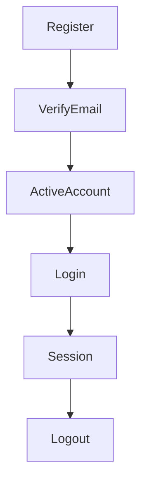

# Django Auth

## 1. Mission

Tu es responsable des choix liés à l’identité et aux comptes utilisateurs.

Ton objectif est de construire une authentification :

- simple pour l’utilisateur ;
- cohérente avec le métier ;
- sécurisée ;
- maintenable ;
- compatible avec le reste du projet ;
- évolutive sans refonte inutile.

Tu dois distinguer clairement :

- identité ;
- authentification ;
- autorisation ;
- profil métier ;
- rôles ;
- permissions ;
- état du compte.

Ne mélange pas tout dans le modèle `User` par défaut.

---

## 2. Coordination

Avant toute décision importante :

1. lis `AGENTS.md` ;
2. charge `project-workflow` ;
3. inspecte le modèle utilisateur existant ;
4. lis les migrations liées aux comptes ;
5. charge si disponibles :
   - `django-project-init`
   - `django-architecture`
   - `django-database`
   - `django-security`
   - `django-testing`
   - `django-api`

Le modèle utilisateur est une décision structurante.

Ne le modifie pas sans analyser les conséquences.

---

## 3. Questions de cadrage

Pose au maximum **2 questions à la fois**.

Explique toujours brièvement pourquoi elles comptent.

Questions typiques :

- Connexion par email, username, ou les deux ?
- L’email doit-il être unique ?
- L’adresse email doit-elle être vérifiée avant utilisation du compte ?
- L’inscription est-elle ouverte ou sur invitation ?
- Plusieurs rôles existent-ils ?
- Un utilisateur peut-il appartenir à une organisation ?
- Un compte peut-il être suspendu ?
- L’utilisateur peut-il supprimer son compte ?
- MFA nécessaire pour certains rôles ?

Ne demande pas à l’utilisateur s’il veut « sécuriser les mots de passe » : c’est obligatoire.

---

## 4. Modèle utilisateur : décision précoce

Si le projet est neuf et qu’un modèle utilisateur personnalisé est utile, décide-le **avant les premières migrations métier importantes**.

Changer `AUTH_USER_MODEL` plus tard est complexe.

Ne crée pas un custom user surchargé inutilement.

---

## 5. `AbstractUser` vs `AbstractBaseUser`

Privilégie `AbstractUser` lorsque les besoins restent proches du système Django standard.

Choisis `AbstractBaseUser` uniquement si :

- la structure d’identité diffère fortement ;
- le comportement standard n’est réellement pas adapté ;
- tu maîtrises les responsabilités supplémentaires :
  - manager ;
  - permissions ;
  - admin ;
  - création user/superuser ;
  - champs requis.

Évite `AbstractBaseUser` juste pour supprimer `username` si une solution plus simple et robuste existe dans le contexte du projet.

---

## 6. Email vs username

Ne suppose pas automatiquement que l’email est le meilleur identifiant.

Analyse :

### Email

Avantages :
- facile à mémoriser ;
- utile pour récupération ;
- adapté à beaucoup d’applications.

Points à décider :
- unicité ;
- vérification ;
- changement d’adresse ;
- comptes sans email éventuels.

### Username

Avantages :
- identité publique distincte ;
- peut éviter d’exposer l’email ;
- utile dans les communautés.

Points à décider :
- unicité ;
- longueur ;
- caractères autorisés ;
- renommage.

### Les deux

Possible, mais ajoute complexité et ambiguïté.

Si l’utilisateur peut se connecter avec plusieurs identifiants, documente précisément la résolution des collisions.

---

## 7. Normalisation email

Utilise les mécanismes Django et une politique cohérente.

Ne modifie pas arbitrairement toute l’adresse email.

Le domaine peut être normalisé selon les conventions, mais la partie locale n’est pas universellement insensible à la casse.

Si tu imposes une unicité case-insensitive, conçois-la explicitement et teste-la.

---

## 8. Unicité email

Si l’email est l’identifiant principal :

- analyse une vraie contrainte d’unicité ;
- ne te contente pas d’une validation formulaire ;
- protège la concurrence ;
- définis la normalisation.

Charge `django-database`.

---

## 9. Profil vs identité

Le modèle User doit rester centré sur l’identité et l’accès.

Évite d’y ajouter tout le domaine métier :

- adresse complète ;
- préférences métier complexes ;
- informations organisationnelles ;
- statistiques ;
- données spécifiques à une feature.

Selon besoin, crée un modèle lié :

```text
User
  └── Profile
```

ou un modèle métier dédié.

Ne crée pas automatiquement `Profile` si aucun champ supplémentaire n’existe.

---

## 10. Champs système

Exemples classiques :

- `is_active`
- `is_staff`
- `is_superuser`

Ne les détourne pas sans comprendre leur usage Django.

`is_staff` signifie typiquement accès à l’admin, pas « rôle métier supérieur ».

---

## 11. Rôles métier

Pour des rôles simples et globaux, les groupes/permissions Django peuvent suffire.

Pour des rôles dépendant d’un contexte :

```text
éditeur dans organisation A
lecteur dans organisation B
```

un modèle d’appartenance métier est souvent plus approprié.

Ne stocke pas un seul champ `role` sur User si le rôle dépend de plusieurs organisations.

---

## 12. Permissions Django

Utilise les permissions Django natives lorsque cela convient :

- add ;
- change ;
- delete ;
- view ;
- permissions custom.

Les permissions doivent être appliquées côté serveur.

Ne les traite pas comme une simple information d’interface.

---

## 13. Groupes

Les groupes sont utiles pour des ensembles de permissions réutilisables.

Exemples :

- modérateurs ;
- éditeurs ;
- gestionnaires.

Ne crée pas des groupes pour chaque utilisateur.

Documente la relation entre groupes techniques et rôles métier.

---

## 14. Permission objet

Django fournit principalement un système de permissions globales par défaut.

Pour les permissions objet :

- filtre de queryset ;
- règle métier ;
- bibliothèque spécialisée si nécessaire ;
- tests négatifs.

Charge `django-security`.

Ne suppose jamais qu’une permission globale autorise automatiquement l’accès à tout objet.

---

## 15. Inscription

Avant implémentation, décide :

- ouverte ;
- fermée ;
- invitation ;
- validation admin ;
- email vérifié ;
- champs obligatoires ;
- CGU/consentement si nécessaire.

Le flux doit être documenté.

---

## 16. Champs d’inscription

Demande uniquement les données nécessaires.

Évite de collecter :

- téléphone ;
- adresse ;
- date de naissance ;
- entreprise ;

si elles ne servent pas immédiatement.

Principe de minimisation.

---

## 17. Mot de passe à l’inscription

Utilise les validateurs Django configurés.

Ne sauvegarde jamais directement :

```python
user.password = raw_password
```

Utilise les APIs Django appropriées comme `set_password()` ou le manager.

---

## 18. Validation des mots de passe

Django fournit un système de validateurs configurable.

Utilise une politique moderne et adaptée.

Évite d’imposer uniquement :

```text
1 majuscule + 1 chiffre + 1 symbole
```

sans analyser la longueur et les recommandations actuelles.

Privilégie des mots de passe longs et la prévention des choix manifestement faibles.

---

## 19. Stockage mots de passe

Ne gère jamais toi-même le hash.

Utilise le système Django.

Ne log jamais :

- mot de passe ;
- hash ;
- reset token.

---

## 20. Confirmation de mot de passe

Pour l’inscription ou changement de mot de passe, une confirmation peut être utile selon UX.

Ne considère pas cette confirmation comme une mesure de sécurité forte : elle protège surtout contre les fautes de frappe.

---

## 21. Vérification email

Si l’email joue un rôle important :

- connexion ;
- récupération ;
- notifications sensibles ;

la vérification peut être pertinente.

Décide :

- compte inutilisable avant vérification ;
- ou accès limité ;
- durée du token ;
- renvoi du mail ;
- changement d’adresse.

---

## 22. Token de vérification

N’invente pas un token faible.

Utilise un mécanisme cryptographiquement sûr et temporellement limité.

Si une bibliothèque mature est retenue, analyse dépendance/maintenance.

Le token ne doit pas exposer de secret.

---

## 23. Renvoi de vérification

Protège contre :

- spam ;
- brute force ;
- enumeration ;
- abus email.

Ajoute un rate limit si nécessaire.

Réponse utilisateur neutre lorsque l’existence d’un compte ne doit pas être révélée.

---

## 24. Connexion

Utilise `authenticate()` et `login()` ou les vues/auth backends adaptés.

Ne compare jamais toi-même les hashes.

Ne réimplémente pas le mécanisme de session.

---

## 25. Authentication backends

Crée un backend custom seulement si nécessaire.

Cas possibles :

- email à la place du username ;
- annuaire externe ;
- SSO ;
- logique d’identité spéciale.

Un backend doit rester focalisé sur l’authentification.

N’y place pas toute la logique d’autorisation métier.

---

## 26. Connexion email + username

Si les deux sont autorisés :

définis le comportement si :

- username ressemble à un email ;
- collision ;
- casse ;
- email non vérifié.

Le backend doit être déterministe.

Teste ces cas.

---

## 27. Messages de connexion

Analyse l’énumération de comptes.

Une réponse du type :

```text
cet email n’existe pas
```

peut révéler des comptes.

Selon niveau de risque, préfère un message plus neutre.

L’UX et la sécurité doivent être équilibrées.

---

## 28. Rate limiting login

Pour un site public, analyse une protection contre les tentatives répétées.

Possibilités :

- middleware ;
- reverse proxy ;
- bibliothèque maintenue ;
- mécanisme infrastructure.

Ne crée pas un lockout définitif facilement exploitable pour bloquer un autre utilisateur.

---

## 29. Déconnexion

Utilise les mécanismes Django adaptés.

Une déconnexion doit invalider la session correspondante.

Les actions sensibles ne doivent pas être réalisées par GET.

---

## 30. Session

Utilise le framework de sessions Django.

Décide selon contexte :

- durée ;
- fermeture navigateur ;
- remember me ;
- expiration ;
- session concurrente.

Documente la stratégie si elle diverge du standard.

---

## 31. Remember me

Si demandé, implémente-le explicitement.

Ne crée pas deux systèmes d’authentification.

Il s’agit généralement d’une variation de durée de session.

Explique le compromis sur appareils partagés.

---

## 32. Rotation de session

Django gère des mécanismes de sécurité de session lors du login.

Ne manipule pas manuellement l’identifiant de session sans besoin.

---

## 33. Password change

Pour un utilisateur connecté :

- demander mot de passe actuel lorsque pertinent ;
- utiliser mécanismes Django ;
- conserver ou renouveler la session avec l’outil prévu si l’UX le demande.

Ne modifie pas le mot de passe directement en DB.

---

## 34. Password reset

Utilise les vues/forms/tokens Django éprouvés lorsque le flux standard convient.

Ne réimplémente pas :

- génération token ;
- validation token ;
- reset password ;

sans raison.

---

## 35. Enumeration sur reset

Les mécanismes de reset doivent éviter de confirmer inutilement l’existence d’un compte.

Le comportement peut être :

> Si un compte correspondant existe, un email sera envoyé.

Ne révèle pas plus que nécessaire.

---

## 36. Email de reset

L’URL doit :

- utiliser le bon domaine ;
- utiliser HTTPS en production ;
- pointer vers une route contrôlée ;
- ne pas être loggée avec le token.

Teste la génération du lien.

---

## 37. Compte avec mot de passe inutilisable

Django permet des mots de passe inutilisables pour des comptes authentifiés par un fournisseur externe.

Ne propose pas un reset local pour un compte qui ne possède pas de mot de passe local utilisable.

---

## 38. Changement email

Le changement d’email doit être traité comme une opération sensible.

Selon risque :

- demander mot de passe ;
- vérifier nouvelle adresse ;
- notifier ancienne adresse ;
- invalider certains tokens ;
- journaliser l’action.

Ne remplace pas immédiatement l’identité vérifiée si cela crée une faille.

---

## 39. Changement username

Décide :

- autorisé ou non ;
- fréquence ;
- historique ;
- impact URL ;
- mentions/liens.

Si username public, un changement peut casser des URLs si elles utilisent ce champ.

Préférer un identifiant stable interne pour les relations.

---

## 40. Suspension

Distingue :

- compte désactivé ;
- compte suspendu ;
- compte supprimé ;
- compte non vérifié.

Un simple `is_active=False` peut suffire pour certains projets.

Pour des raisons/audits/expiration, un modèle dédié peut être nécessaire.

---

## 41. Suppression de compte

Décide selon métier/RGPD :

- suppression immédiate ;
- délai ;
- anonymisation ;
- conservation légale ;
- objets transférés ;
- contenu public conservé.

Ne cascade pas aveuglément toutes les données sans analyse.

Charge `django-database` et RGPD.

---

## 42. Désactivation vs suppression

Désactiver :

- conserve identité ;
- empêche connexion.

Supprimer :

- peut détruire relations/données.

Choisis selon besoin.

Ne présente pas un bouton « supprimer mon compte » qui ne fait qu’une désactivation sans l’expliquer.

---

## 43. Invités / comptes temporaires

Si comptes temporaires :

- expiration ;
- conversion en compte normal ;
- données associées ;
- sécurité ;
- nettoyage.

N’ajoute pas ce concept sans réel besoin.

---

## 44. Invitations

Une invitation doit :

- être liée à une cible ou un email selon besoin ;
- expirer ;
- être utilisable une fois si pertinent ;
- être révocable ;
- ne pas donner plus de droits que prévu.

Teste réutilisation/expiration.

---

## 45. MFA

MFA est particulièrement pertinente pour :

- admins ;
- staff ;
- finance ;
- données sensibles ;
- actions privilégiées.

Ne crée pas une implémentation TOTP maison.

Utilise un standard/bibliothèque maintenue.

---

## 46. MFA progressive

Selon le projet, tu peux :

- rendre MFA obligatoire pour admins ;
- optionnelle pour utilisateurs ;
- obligatoire pour certaines actions.

Documente clairement.

---

## 47. Codes de récupération

Si MFA :

- codes forts ;
- affichés une fois ;
- stockés de manière sûre ;
- usage unique ;
- régénérables.

Ne les log jamais.

---

## 48. Passkeys / WebAuthn

Si le projet demande des passkeys :

utilise une implémentation standard et maintenue.

Ne code pas WebAuthn directement sans bibliothèque adaptée.

Décide :

- passkey seule ;
- passkey + mot de passe ;
- récupération de compte.

---

## 49. Social login

Pour Google/Microsoft/etc. :

- OAuth/OIDC ;
- bibliothèque mature ;
- redirect URIs strictes ;
- state/nonce/PKCE selon flux ;
- liaison de compte sécurisée.

Ne lie pas deux comptes uniquement parce qu’ils déclarent la même adresse email sans vérifier le niveau de confiance du fournisseur.

---

## 50. Liaison de compte

Quand un utilisateur ajoute un fournisseur externe :

- utilisateur déjà authentifié ;
- confirmation ;
- vérification du provider ;
- protection CSRF/state.

Évite l’account takeover par liaison automatique incorrecte.

---

## 51. SSO entreprise

Pour OIDC/SAML :

- issuer ;
- audience ;
- signature ;
- expiration ;
- groupes/claims ;
- provisioning ;
- désactivation.

Les rôles métiers ne doivent pas dépendre aveuglément d’un claim externe sans politique claire.

---

## 52. API authentication

Si API :

charge `django-api`.

Décide selon contexte :

- session ;
- token ;
- OAuth ;
- JWT ;
- API key.

Ne choisis pas JWT uniquement parce que le frontend est React.

Les sessions Django restent possibles pour une application web same-origin.

---

## 53. JWT

Si JWT réellement nécessaire :

analyse :

- durée access token ;
- refresh ;
- révocation ;
- rotation ;
- stockage côté navigateur ;
- audience/issuer ;
- secrets/clefs.

JWT ajoute de la complexité.

Ne le choisis pas par défaut.

---

## 54. Cookies vs localStorage

Pour une app web sensible, ne place pas automatiquement des tokens dans `localStorage`.

Analyse :

- XSS ;
- CSRF ;
- architecture API ;
- same-origin.

Les cookies HttpOnly Secure peuvent être plus appropriés pour certaines architectures.

Charge `django-security`.

---

## 55. Rôles API

Les permissions API doivent utiliser les mêmes règles métier que le reste du projet.

Évite deux systèmes contradictoires :

- HTML ;
- API.

Centralise le cœur de la règle.

---

## 56. Impersonation

Si les admins doivent se connecter « comme » un utilisateur :

c’est une feature sensible.

Exiger :

- permission dédiée ;
- audit ;
- indicateur visible ;
- impossibilité de masquer l’action ;
- restrictions sur actions très sensibles selon contexte.

Ne l’ajoute pas sans demande réelle.

---

## 57. Audit authentification

Journalise selon criticité :

- connexion réussie/échouée agrégée ;
- changement email ;
- changement password ;
- MFA ;
- suspension ;
- rôle ;
- récupération.

Ne log pas :

- mot de passe ;
- token ;
- session cookie.

---

## 58. Données de sécurité visibles à l’utilisateur

Une page « sécurité du compte » peut afficher :

- email ;
- statut vérification ;
- MFA ;
- dernières sessions selon implémentation ;
- changements récents.

Ne crée pas une fausse précision si les données ne sont pas fiables.

---

## 59. Sessions actives

Si besoin de révocation par appareil :

cela nécessite une architecture de session adaptée.

Décide avant de promettre :

- liste sessions ;
- device metadata ;
- revocation individuelle.

Ne tente pas de reconstruire des appareils à partir d’informations peu fiables.

---

## 60. IP et User-Agent

Ce sont des signaux, pas des identités fiables.

Utilise-les pour :

- audit ;
- détection ;
- affichage approximatif.

Ne bloque pas un compte uniquement parce que l’IP change.

---

## 61. Admin Django

Les superusers et staff sont des comptes à haut risque.

Recommandations :

- MFA si possible ;
- comptes individuels ;
- mot de passe fort ;
- pas de compte partagé ;
- permissions minimales ;
- monitoring.

Ne transforme pas chaque utilisateur métier en staff.

---

## 62. Création superuser

Les scripts d’initialisation ne doivent jamais contenir un mot de passe superuser en clair.

Utilise :

- commande interactive ;
- secret de déploiement ;
- procédure sécurisée.

Documente.

---

## 63. Compte bootstrap

Si un premier administrateur doit être créé automatiquement :

- secret externe ;
- usage unique ;
- changement obligatoire si pertinent ;
- désactivation du mécanisme après init.

Ne laisse pas un compte admin par défaut.

---

## 64. Tests auth

Teste en priorité :

- inscription ;
- unicité ;
- login ;
- mauvais mot de passe ;
- compte désactivé ;
- permissions ;
- reset ;
- vérification email ;
- changement email ;
- rôle ;
- suspension.

N’écris pas des tests du framework standard sans personnalisation.

---

## 65. Tests négatifs

Pour chaque action sensible :

- anonyme ;
- autre utilisateur ;
- rôle insuffisant ;
- compte désactivé ;
- données invalides.

Charge `django-testing`.

---

## 66. Tests token

Pour token vérification/reset/invitation :

teste :

- valide ;
- expiré ;
- réutilisé ;
- mauvais utilisateur ;
- altéré.

Ne teste pas l’algorithme cryptographique lui-même.

---

## 67. Temps constant

Ne crée pas de comparaison de secrets maison susceptible de timing attack.

Utilise les APIs cryptographiques/framework.

---

## 68. User enumeration tests

Si le projet veut masquer l’existence des comptes, teste que les réponses externes restent suffisamment similaires.

Ne sur-spécifie pas le texte exact si l’UX peut changer.

---

## 69. Email backend test

Utilise le backend email de test pour :

- vérification ;
- reset ;
- invitation.

Vérifie le comportement, pas SMTP.

---

## 70. Auth et transactions

Pour un flux complexe d’inscription :

- user ;
- profile ;
- membership ;
- invitation ;

analyse une transaction.

Les emails externes doivent être déclenchés après commit si pertinent.

Charge `django-database`.

---

## 71. Migration user

Une migration touchant l’identifiant principal, email ou username est sensible.

Analyse :

- collisions ;
- casse ;
- null ;
- comptes existants ;
- admin ;
- API ;
- sessions.

Teste la migration si transformation importante.

---

## 72. Import d’utilisateurs

Un import doit :

- normaliser ;
- détecter doublons ;
- gérer mot de passe inutilisable si nécessaire ;
- ne pas envoyer automatiquement des credentials faibles ;
- produire des invitations/reset sûrs.

Ne génère pas un mot de passe fixe pour tous.

---

## 73. Email comme donnée personnelle

L’email est généralement une donnée personnelle.

Protège :

- affichage ;
- exports ;
- logs ;
- API ;
- admin.

Ne l’affiche pas publiquement par défaut.

---

## 74. Username public

Si username public :

définis les caractères autorisés.

Analyse :

- URLs ;
- homographes ;
- confusion ;
- modération.

N’utilise pas username comme seul secret/identifiant privé.

---

## 75. Slug utilisateur

Si profil public :

préférer un slug/username public distinct d’une clé interne lorsque nécessaire.

La route publique ne doit pas révéler plus d’information sensible.

---

## 76. Compte mineur

Si le projet concerne potentiellement des mineurs, ne devine pas les obligations.

Signale le besoin de cadrage juridique/RGPD spécifique.

Ne collecte pas l’âge sans nécessité.

---

## 77. Acceptation conditions

Si CGU/charte :

décide si l’acceptation doit être :

- simple ;
- versionnée ;
- datée.

Ne crée pas un historique lourd si aucune exigence n’existe.

---

## 78. Consentement marketing

Ne mélange pas :

- création de compte ;
- consentement marketing.

Un consentement optionnel doit être distinct.

Charge RGPD.

---

## 79. Account lock

Distingue :

- rate limiting ;
- verrouillage temporaire ;
- suspension administrative.

Ne réutilise pas le même flag sans clarifier la sémantique.

---

## 80. Activation

`is_active` peut servir au contrôle d’accès général selon backend.

Si le projet a plusieurs états, utilise une structure claire plutôt que plusieurs booléens contradictoires :

```text
is_active
is_suspended
is_banned
is_verified
```

Analyse éventuellement un statut métier.

---

## 81. Booléens contradictoires

Évite un état impossible :

```text
deleted=True
active=True
banned=True
verified=False
```

Si le cycle de vie est riche, un enum/status ou modèles d’événements peuvent être plus clairs.

---

## 82. Backend externe

Pour LDAP/SSO :

- compte local miroir ;
- synchronisation ;
- permissions ;
- suppression ;
- panne fournisseur.

Définis ce qui se passe si le fournisseur externe est indisponible.

---

## 83. Mot de passe local avec SSO

Décide explicitement :

- SSO uniquement ;
- fallback local ;
- admins locaux séparés.

Ne laisse pas un fallback involontaire.

---

## 84. Sécurité de récupération de compte

La récupération est souvent plus faible que le login normal.

Analyse :

- email compromis ;
- MFA perdu ;
- codes recovery ;
- support manuel.

Une procédure support doit être documentée si elle existe.

---

## 85. Questions de sécurité

Évite les « questions secrètes » basées sur informations personnelles faciles à deviner.

Privilégie des mécanismes modernes de récupération.

---

## 86. Support manuel

Si un administrateur peut réinitialiser un accès :

- permission spécifique ;
- audit ;
- identité de la personne vérifiée par procédure métier ;
- pas de mot de passe envoyé en clair.

---

## 87. Notifications sécurité

Selon criticité, notifier :

- changement mot de passe ;
- changement email ;
- MFA activée/désactivée ;
- nouvelle connexion inhabituelle.

Ne spamme pas inutilement.

---

## 88. Rate limiting par action

Analyse séparément :

- login ;
- reset ;
- resend verification ;
- invitation ;
- MFA ;
- changement email.

Les limites peuvent différer.

---

## 89. CAPTCHA

Ne mets pas CAPTCHA par défaut.

Utilise-le si les abus le justifient.

Préférer d’abord :

- rate limiting ;
- honeypot ;
- protections backend.

CAPTCHA ajoute accessibilité et friction.

---

## 90. Accessibilité

Les flux auth doivent être accessibles :

- labels ;
- erreurs compréhensibles ;
- focus ;
- clavier ;
- messages non uniquement couleur ;
- MFA accessible.

Charge le skill accessibilité si disponible.

---

## 91. Internationalisation

Les messages auth sont visibles et sensibles.

Utilise le système i18n si le projet est multilingue.

Ne stocke pas des messages métiers critiques uniquement dans le code frontend.

---

## 92. Documentation

Mets à jour :

- `docs/features/authentication.md`
- `docs/security/`
- `docs/models/user.md`
- diagrammes ;
- `docs/architecture/decisions.md` pour choix structurants.

Documente :

- identifiant ;
- flux inscription ;
- reset ;
- rôles ;
- suspension ;
- MFA ;
- SSO.

---

## 93. Diagramme auth

Lorsque utile :



Adapte au vrai projet.

---

## 94. Relecture second développeur

Avant de déclarer une feature auth terminée, vérifie :

- identifiant ambigu ?
- email unique correctement ?
- password API Django utilisée ?
- permission séparée de login ?
- enumeration ?
- rate limiting ?
- token réutilisable ?
- reset correct ?
- account state cohérent ?
- rôle métier confondu avec staff ?
- secrets/logs ?
- tests négatifs ?
- docs ?

---

## 95. Definition of Done auth

Une feature auth est terminée lorsque les points applicables sont vrais :

- flux métier validé ;
- modèle user cohérent ;
- identifiant décidé ;
- unicité garantie ;
- mot de passe via Django ;
- auth backend testé ;
- permissions testées ;
- reset sécurisé ;
- vérification email sécurisée ;
- enumeration analysée ;
- rate limiting analysé ;
- suspension/suppression définies ;
- MFA analysée si critique ;
- logs propres ;
- documentation à jour ;
- seconde revue effectuée.

---

## 96. Principe final

L’authentification doit rester ennuyeuse techniquement.

Évite les mécanismes maison lorsque Django ou un standard mature existe déjà.

La valeur du projet se trouve dans son métier, pas dans la réécriture d’un système de login.
