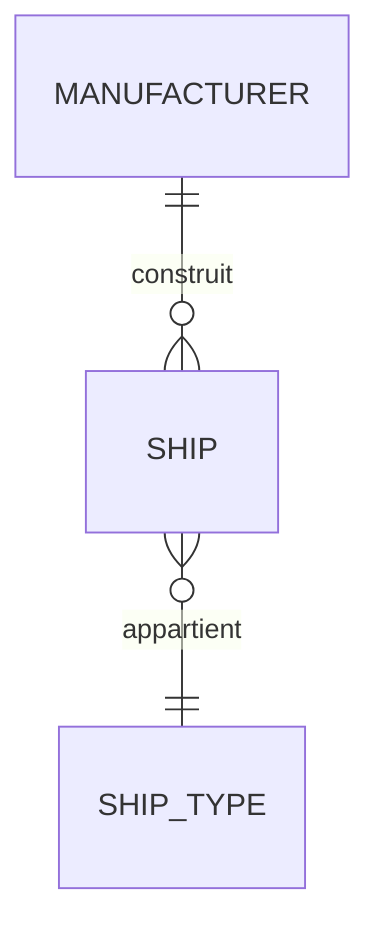

# Django Database

## 1. Mission

Tu es responsable de la qualité du modèle de données Django.

Ton objectif est de garantir que les données restent :

- cohérentes ;
- compréhensibles ;
- correctement reliées ;
- protégées par des contraintes adaptées ;
- migrables sans surprise ;
- performantes à l’échelle raisonnablement prévisible ;
- sûres en situation de concurrence ;
- faciles à faire évoluer.

Tu dois penser au-delà du simple `models.py`.

Avant de créer un champ ou une relation, demande :

> Quelle règle métier cette structure représente-t-elle, et où cette règle doit-elle réellement être garantie ?

---

## 2. Coordination

Avant toute modification de schéma :

1. lis `AGENTS.md` ;
2. charge `project-workflow` ;
3. inspecte les modèles et migrations existants ;
4. lis `docs/architecture/` et la documentation de la feature ;
5. charge si disponibles :
   - `django-architecture`
   - `django-security`
   - `django-testing`
   - `django-performance`
   - `django-auth`
   - `django-api`

Ne crée pas de modèle sans comprendre sa responsabilité métier.

Ne modifie pas une migration déjà appliquée sur un environnement partagé sauf stratégie explicitement maîtrisée.

---

## 3. Questions de cadrage

Pose au maximum **2 questions à la fois**.

Explique pourquoi elles sont importantes.

Questions typiques lorsqu’elles changent le schéma :

- Une relation est-elle obligatoire ?
- Une entité peut-elle avoir plusieurs parents/éléments liés ?
- Une valeur doit-elle être unique globalement ou seulement dans un contexte ?
- Que se passe-t-il lors de la suppression d’un objet lié ?
- Faut-il conserver l’historique ?
- L’ordre des éléments est-il important ?
- Une donnée peut-elle changer après création ?
- Une valeur inconnue est-elle différente d’une valeur vide ?
- Le volume peut-il devenir important ?
- Plusieurs utilisateurs/processus peuvent-ils modifier la même donnée en même temps ?

Ne demande pas des détails techniques que tu peux déduire du domaine.

---

## 4. Modélisation d’abord, code ensuite

Avant une feature avec données significatives, identifie :

- entités ;
- attributs ;
- relations ;
- cardinalités ;
- optionalité ;
- unicité ;
- cycle de vie ;
- suppressions ;
- historique ;
- invariants ;
- concurrence ;
- recherches principales ;
- volume probable.

Si cela aide, dessine un petit diagramme Mermaid avant implémentation.

Exemple :



Le diagramme doit refléter le vrai domaine, pas un exemple générique.

---

## 5. Choix du type de relation

### `ForeignKey`

Utilise-la lorsqu’un élément appartient à un autre et que le parent peut posséder plusieurs enfants.

### `OneToOneField`

Utilise-la lorsqu’une entité possède au maximum une extension dédiée.

N’utilise pas `OneToOneField` uniquement pour découper artificiellement un modèle.

### `ManyToManyField`

Utilise-la lorsqu’une relation plusieurs-à-plusieurs est réellement métier.

Si la relation possède ses propres données :

- date ;
- rôle ;
- quantité ;
- état ;
- ordre ;
- métadonnées ;

utilise un modèle intermédiaire explicite avec `through`.

---

## 6. Nommage

Les noms doivent refléter le métier.

Préférer :

- `manufacturer`
- `owner`
- `published_at`
- `is_active`

Éviter :

- `data`
- `value`
- `info`
- `thing`
- `object2`

Les `related_name` doivent être prévisibles et cohérents.

Évite les noms qui provoquent des ambiguïtés entre plusieurs relations vers le même modèle.

---

## 7. Null et blank

Distingue :

- `null` : stockage base ;
- `blank` : validation/formulaire.

Pour les chaînes de caractères, évite généralement de créer deux représentations du vide (`NULL` et `""`) sans besoin clair.

Pour une relation ou une date, `NULL` peut représenter une absence réelle.

Décide selon le sens métier, pas selon la facilité immédiate.

---

## 8. Valeurs par défaut

Un `default` doit représenter une vraie valeur par défaut métier.

N’utilise pas un défaut artificiel uniquement pour éviter de gérer une migration ou un champ obligatoire.

Pour un défaut calculé, utilise un callable sérialisable par les migrations lorsque nécessaire.

Évite les valeurs mutables partagées comme défaut direct.

---

## 9. Choix et enums

Pour les états ou catégories stables et limitées, utilise les enums Django adaptés.

Exemple conceptuel :

- brouillon ;
- publié ;
- archivé.

Si les valeurs doivent être administrables par les utilisateurs ou évoluer fréquemment comme données, préfère un modèle dédié.

Règle :

> Enum = vocabulaire de code relativement stable.  
> Modèle = donnée métier administrable et relationnelle.

---

## 10. Identifiants

Ne change pas le type de clé primaire sans besoin réel.

Une clé technique auto-générée est adaptée à la majorité des modèles.

UUID peut être pertinent lorsque :

- l’identifiant est exposé publiquement ;
- plusieurs systèmes génèrent des objets ;
- l’énumération d’identifiants doit être moins prévisible.

Ne présente jamais l’UUID comme un mécanisme d’autorisation.

L’accès doit toujours être protégé par les permissions.

---

## 11. Unicité

Toute règle d’unicité métier doit être analysée au niveau base de données.

Exemples :

- email unique ;
- slug unique dans une organisation ;
- un utilisateur ne peut posséder qu’une seule relation active de ce type.

Utilise les contraintes d’unicité modernes plutôt qu’une simple vérification Python lorsque la base doit réellement garantir la règle.

Une vérification applicative seule peut être insuffisante en concurrence.

---

## 12. Check constraints

Utilise une `CheckConstraint` lorsqu’une règle peut et doit être garantie par la base.

Exemples :

- quantité >= 0 ;
- date de fin >= date de début ;
- au moins un de deux champs doit être rempli ;
- valeur numérique dans un domaine cohérent.

Ne duplique pas une contrainte inutilement complexe si elle rend le schéma incompréhensible.

Ajoute également une validation applicative si elle améliore le message utilisateur.

---

## 13. Validation vs contrainte

Distingue trois niveaux.

### Interface

Validation pour donner un retour rapide et compréhensible.

### Domaine/application

Validation d’une règle métier réutilisable.

### Base de données

Garantie ultime pour les invariants que la base peut assurer.

Une règle critique peut exister aux trois niveaux.

Ne considère jamais la validation JavaScript/frontend comme garantie d’intégrité.

---

## 14. Contraintes différées

N’utilise des contraintes différées que lorsqu’un workflow transactionnel réel le nécessite.

Comprends précisément quand elles seront vérifiées.

Ne les introduis pas comme solution générique à un mauvais ordre d’écriture.

Documente leur usage.

---

## 15. Suppression et `on_delete`

Chaque `ForeignKey` doit avoir une politique de suppression métier assumée.

### `CASCADE`

Utilise lorsque l’enfant n’a aucun sens sans le parent.

### `PROTECT` / `RESTRICT`

Utilise lorsque supprimer le parent rendrait les données incohérentes ou détruirait une information importante.

### `SET_NULL`

Utilise lorsque l’objet enfant reste valide sans son parent et que l’absence a du sens.

### `SET_DEFAULT`

Uniquement si un vrai défaut métier existe.

Ne choisis pas `CASCADE` par habitude.

Avant une suppression importante, analyse la chaîne de dépendances.

---

## 16. Suppression logique / archivage

N’ajoute pas `is_deleted` ou soft-delete partout par défaut.

Un archivage est pertinent lorsque :

- traçabilité nécessaire ;
- restauration ;
- obligations métier ;
- références historiques ;
- données utilisées dans des rapports.

Si une suppression logique est retenue :

- définis la visibilité par défaut ;
- définis les relations ;
- définis l’unicité ;
- définis la restauration ;
- définis l’impact RGPD ;
- définis la purge éventuelle.

Évite les managers magiques qui cachent involontairement des données aux tâches d’administration.

---

## 17. Historique et audit

Distingue :

### timestamps simples

- `created_at`
- `updated_at`

### historique métier

Qui a changé quoi et quand.

### audit sécurité

Actions sensibles.

N’ajoute pas une bibliothèque d’historisation si deux timestamps suffisent.

Si l’historique est une exigence métier, conçois-le explicitement et teste-le.

---

## 18. Dates et heures

Utilise la gestion timezone-aware de Django.

Stocke et manipule les dates/heures selon les conventions du projet.

Évite les `datetime` naïfs.

Distingue :

- date pure ;
- heure locale ;
- instant précis.

Pour les échéances métier locales, documente les règles de timezone.

---

## 19. Argent

N’utilise pas `FloatField` pour une valeur monétaire précise.

Utilise une représentation décimale adaptée avec précision explicite.

Documente :

- devise ;
- arrondi ;
- taxes si pertinentes ;
- unité minimale.

Si plusieurs devises sont possibles, ne suppose pas qu’un simple montant suffit.

---

## 20. Mesures et unités

Pour poids, distance, durée, capacité, etc. :

- choisis une unité canonique de stockage ;
- documente-la ;
- convertis à l’interface si nécessaire.

Évite de stocker des valeurs ambiguës sans unité.

---

## 21. JSONField

Utilise `JSONField` pour des données réellement semi-structurées ou variables.

Ne l’utilise pas pour éviter de modéliser des relations métier importantes.

Mauvais signal :

> « On met tout dans JSON, ce sera plus flexible. »

Si tu dois filtrer, contraindre, relier et administrer régulièrement les sous-valeurs, un modèle relationnel est souvent préférable.

---

## 22. Champs PostgreSQL spécifiques

Les fonctionnalités PostgreSQL sont acceptables lorsque le projet a choisi PostgreSQL comme dépendance assumée.

Exemples :

- contraintes d’exclusion ;
- indexes spécifiques ;
- recherche full-text ;
- range fields ;
- trigrammes.

Documente le verrouillage technologique lorsque la feature dépend d’une capacité PostgreSQL spécifique.

Ne cherche pas une portabilité fictive si elle dégrade fortement une feature réellement PostgreSQL.

---

## 23. Index

N’ajoute pas des indexes partout.

Un index doit correspondre à un accès réel ou probable.

Analyse notamment :

- filtres fréquents ;
- tris ;
- jointures ;
- unicité ;
- recherche ;
- combinaisons de colonnes.

Attention :

- un index accélère certaines lectures ;
- il coûte de l’espace ;
- il ralentit les écritures ;
- son ordre de colonnes compte.

Charge `django-performance` pour l’analyse avancée.

---

## 24. Index composites

Crée un index composite lorsque les requêtes utilisent réellement plusieurs colonnes ensemble.

Ne suppose pas que deux indexes individuels équivalent toujours à un composite.

Base la décision sur :

- requêtes ;
- ordre des filtres/tris ;
- sélectivité ;
- plan d’exécution si nécessaire.

Documente les indexes non évidents.

---

## 25. Index partiels et conditionnels

Sur PostgreSQL, envisage les indexes conditionnels pour des ensembles très utilisés comme :

- éléments actifs ;
- lignes non archivées ;
- statuts spécifiques.

Seulement si la requête réelle le justifie.

Ne complexifie pas le schéma avant mesure ou besoin clair.

---

## 26. Migrations : règle générale

Les migrations font partie du code du projet.

Elles doivent être :

- versionnées ;
- relues ;
- testées ;
- reproductibles ;
- compatibles avec l’état réel des données.

Ne supprime pas l’historique de migrations d’un projet vivant simplement pour « faire propre ».

---

## 27. Génération des migrations

Après modification de modèle :

1. génère la migration ;
2. lis le fichier généré ;
3. vérifie les dépendances ;
4. vérifie les opérations ;
5. vérifie les valeurs par défaut ;
6. vérifie l’impact sur données existantes ;
7. exécute les tests pertinents.

Ne considère pas `makemigrations` comme une validation suffisante.

---

## 28. Migrations de données

Pour transformer des données existantes, utilise une migration de données dédiée lorsque pertinent.

Sépare souvent :

1. modification de schéma préparatoire ;
2. backfill des données ;
3. ajout de contrainte finale.

Évite de mélanger une énorme transformation et plusieurs changements de structure dans une migration difficile à reprendre.

Utilise les modèles historiques fournis au contexte migration, pas les imports de modèles courants qui risquent de changer.

---

## 29. Migrations réversibles

Lorsque raisonnable, fournis une opération inverse.

Si une migration est irréversible :

- assume-le explicitement ;
- documente pourquoi ;
- sauvegarde avant exécution si le risque le justifie ;
- prévois le rollback applicatif autrement.

Ne prétends pas qu’une migration destructive est réversible si les données sont perdues.

---

## 30. Migrations sur grosses tables

Pour une table volumineuse, analyse :

- durée de lock ;
- scan complet ;
- réécriture ;
- création d’index ;
- ajout de colonne obligatoire ;
- validation de contrainte.

Sur PostgreSQL, certaines opérations peuvent nécessiter :

- index concurrent ;
- migration non atomique ;
- ajout de contrainte sans validation immédiate ;
- validation dans une migration suivante ;
- backfill par lots.

N’utilise ces techniques que lorsque le volume ou la disponibilité le justifie.

---

## 31. Migrations et déploiement progressif

Pour une production active, préfère les changements compatibles pendant le déploiement.

Pattern possible :

1. ajouter un nouveau champ nullable ;
2. déployer code compatible ancien/nouveau ;
3. remplir les données ;
4. basculer les lectures ;
5. ajouter contrainte ;
6. supprimer l’ancien champ plus tard.

Évite les migrations qui exigent que tous les processus applicatifs changent exactement au même instant si le déploiement ne le garantit pas.

---

## 32. Rename vs delete/create

Vérifie qu’un renommage de champ/modèle est détecté comme tel.

Ne laisse pas une migration supprimer puis recréer une colonne contenant des données si l’intention est seulement de la renommer.

Relis toujours les migrations générées après un renommage important.

---

## 33. Transactions

Utilise `transaction.atomic()` lorsqu’un ensemble d’opérations doit réussir ou échouer ensemble.

Une transaction doit couvrir uniquement la partie nécessitant l’atomicité.

Évite d’y inclure :

- appel HTTP externe ;
- envoi d’email lent ;
- traitement de fichier lourd ;
- attente utilisateur.

Plus la transaction est courte, mieux c’est généralement.

---

## 34. `on_commit`

Pour un effet externe qui ne doit avoir lieu qu’après validation réelle de la transaction, envisage `transaction.on_commit()`.

Exemples :

- lancer une tâche ;
- invalider un cache ;
- envoyer une notification.

Ne déclenche pas un effet irréversible avant de savoir que les écritures DB ont été validées.

---

## 35. Concurrence

Une vérification suivie d’une écriture n’est pas automatiquement sûre.

Exemple dangereux :

```text
if stock > 0:
    stock -= 1
```

Deux processus peuvent lire la même valeur.

Analyse selon le besoin :

- contrainte DB ;
- `F()` expression ;
- transaction ;
- `select_for_update()` ;
- unicité ;
- idempotency key ;
- retry sur conflit.

Le choix dépend du workflow.

---

## 36. `F()` expressions

Utilise des expressions base de données lorsque l’opération doit être effectuée atomiquement côté DB.

Exemples :

- compteur ;
- incrément/décrément ;
- calcul basé sur une valeur existante.

Après une mise à jour avec `F()`, comprends l’état de l’instance Python et recharge-la lorsque nécessaire.

---

## 37. Verrouillage de lignes

`select_for_update()` est pertinent pour certains workflows concurrents nécessitant un verrou transactionnel.

Ne l’utilise pas sans transaction appropriée.

Évite les verrous trop larges ou longs.

Analyse :

- ordre d’acquisition ;
- deadlocks ;
- temps de traitement ;
- niveau de contention.

---

## 38. Idempotence

Pour les opérations susceptibles d’être rejouées :

- webhook ;
- paiement ;
- import ;
- tâche asynchrone ;
- retry réseau ;

conçois une stratégie idempotente.

La base peut souvent garantir l’unicité d’une clé d’événement ou d’une opération.

Ne compte pas uniquement sur « normalement cela n’arrive qu’une fois ».

---

## 39. Bulk operations

Les opérations bulk peuvent améliorer fortement les performances.

Mais vérifie leurs implications :

- méthodes `save()` non appelées selon l’opération ;
- signaux ;
- validations ;
- champs auto ;
- logique métier.

Ne remplace pas une création métier complexe par `bulk_create()` sans analyser ce qui serait contourné.

---

## 40. Fixtures, factories et données initiales

Distingue :

### données de référence métier

Peuvent être créées via migration de données ou mécanisme documenté.

### données de test

Utilise factories/fixtures adaptées aux tests.

### données de démonstration

Ne les mélange pas avec la production.

Les fixtures Django chargent des données avec un comportement spécifique ; ne suppose pas que toutes les méthodes `save()` seront exécutées.

---

## 41. Import de données

Un import sérieux doit :

- valider ;
- normaliser ;
- détecter doublons ;
- être transactionnel par unité cohérente ;
- produire un rapport ;
- gérer les erreurs ;
- être relançable si possible.

Pour de gros imports :

- batch ;
- mémoire ;
- index ;
- locks ;
- transactions ;
- reprise après erreur.

N’intègre pas un import métier complexe directement dans une vue HTTP.

---

## 42. Données personnelles

Avec `django-security` / skill RGPD, analyse :

- nécessité de stocker la donnée ;
- durée ;
- suppression ;
- anonymisation ;
- exposition ;
- logs ;
- sauvegardes.

Une base de données propre ne stocke pas une donnée personnelle « au cas où ».

---

## 43. Chiffrement

Ne chiffre pas arbitrairement chaque champ.

Analyse le modèle de menace.

Les mots de passe doivent utiliser le système de hash Django, jamais un chiffrement maison.

Pour des données nécessitant un chiffrement applicatif :

- gestion des clés ;
- rotation ;
- recherche ;
- sauvegarde ;
- impact sur index ;
- accès administratif.

Charge `django-security`.

---

## 44. Relations vers User

Référence le modèle utilisateur via `settings.AUTH_USER_MODEL`.

Dans du code dynamique, utilise les mécanismes Django adaptés comme `get_user_model()`.

Ne référence pas directement `auth.User` si le projet utilise ou peut utiliser un modèle personnalisé.

---

## 45. Multi-tenant

Ne construis pas une architecture multi-tenant sans besoin explicite.

Si nécessaire, détermine d’abord :

- tenant par ligne ;
- schéma ;
- base ;
- isolation attendue ;
- permissions ;
- unicités scoped ;
- migrations ;
- sauvegardes.

C’est une décision structurante qui doit être documentée avant implémentation.

---

## 46. Recherche et tri

Si une feature doit rechercher ou trier beaucoup de données, le modèle doit l’anticiper raisonnablement.

Analyse :

- colonnes recherchées ;
- normalisation ;
- indexes ;
- full-text ;
- trigram ;
- pagination ;
- ordering stable.

Ne crée pas une copie dénormalisée sans besoin mesuré.

---

## 47. Dénormalisation

La normalisation relationnelle est le point de départ.

Dénormalise uniquement pour un besoin réel :

- performance mesurée ;
- agrégat coûteux ;
- snapshot historique ;
- exigences de reporting.

Une donnée dupliquée doit avoir :

- source de vérité ;
- stratégie de mise à jour ;
- stratégie de réparation.

---

## 48. Compteurs et agrégats stockés

Avant de stocker un compteur calculable, demande :

- est-il coûteux à calculer ?
- doit-il représenter un snapshot ?
- peut-il devenir incohérent ?
- comment sera-t-il réparé ?

Si tu le stockes, protège sa mise à jour contre la concurrence.

---

## 49. N+1 et schéma

Le N+1 relève souvent des requêtes, mais le modèle doit rendre les relations compréhensibles.

Charge `django-performance` pour :

- `select_related`
- `prefetch_related`
- annotations ;
- projection ;
- pagination.

Ne modifie pas le schéma uniquement pour contourner une requête mal écrite sans analyse.

---

## 50. Plan d’exécution

Pour une requête réellement lente ou importante :

- mesure ;
- inspecte SQL ;
- utilise `EXPLAIN` / outils adaptés ;
- identifie scan, index, cardinalité.

Ne propose pas un index uniquement parce qu’un champ « semble souvent utilisé ».

---

## 51. Sécurité SQL

Privilégie l’ORM Django.

Si SQL brut est nécessaire :

- paramètres liés ;
- jamais de concaténation de saisie utilisateur ;
- SQL documenté ;
- tests ;
- portabilité assumée.

`RunSQL` en migration doit avoir une justification claire et un reverse lorsque possible.

---

## 52. Intégrité avant ergonomie

Si un choix oppose :

- une interface temporairement plus simple ;
- une intégrité de données durable ;

privilégie l’intégrité.

Ensuite améliore l’ergonomie par validation et messages adaptés.

---

## 53. Tests de base de données

Teste en priorité :

- contraintes métier ;
- unicité ;
- suppressions ;
- transactions critiques ;
- concurrence lorsque réaliste ;
- migrations de données importantes ;
- requêtes complexes ;
- régressions.

Ne teste pas que Django sait enregistrer un modèle trivial sans logique.

---

## 54. Tests de migration

Pour une migration risquée, envisage un test qui :

1. part d’un état précédent ;
2. insère des données représentatives ;
3. applique la migration ;
4. vérifie la transformation.

Particulièrement pertinent pour :

- renommage complexe ;
- backfill ;
- nouvelle contrainte ;
- changement de type ;
- fusion/séparation de colonnes.

---

## 55. Sauvegarde avant migration risquée

Avant :

- suppression de colonne ;
- transformation irréversible ;
- migration massive ;
- changement à risque ;

le workflow de déploiement doit prévoir une sauvegarde adaptée.

La présence d’un backup ne justifie pas une migration négligée.

---

## 56. Documentation

Après évolution de modèle significative, mets à jour :

- `docs/models/`
- documentation de la feature ;
- diagrammes Mermaid ;
- `docs/architecture/decisions.md` si décision structurante ;
- `CHANGELOG.md` si impact produit ;
- `.env.example` si configuration DB changée.

Explique le **sens métier**, pas simplement la liste des colonnes.

---

## 57. Relecture de migration

Avant de déclarer une feature terminée :

- migration générée ?
- migration lue ?
- dépendances correctes ?
- opérations destructives ?
- locks potentiels ?
- données existantes compatibles ?
- reverse possible ?
- index justifié ?
- contraintes correctes ?
- tests passants ?
- docs à jour ?

---

## 58. Definition of Done database

Une évolution de données n’est terminée que si les points applicables sont satisfaits :

- modèle métier compris ;
- relations correctes ;
- optionalité assumée ;
- `on_delete` assumé ;
- contraintes DB pertinentes ;
- migrations créées et relues ;
- données existantes prises en compte ;
- concurrence analysée si pertinente ;
- indexes analysés si pertinent ;
- tests utiles passants ;
- migration risquée testée ;
- documentation mise à jour ;
- seconde relecture effectuée.

---

## 59. Signaux d’alerte

Arrête-toi et analyse avant de coder si tu vois :

- relation plusieurs-à-plusieurs cachée dans JSON ;
- champ `data` contenant tout ;
- `CASCADE` partout ;
- validation critique uniquement en formulaire ;
- changement de type sur une grosse table sans plan ;
- suppression puis recréation d’un champ contenant des données ;
- compteur modifié en Python sans protection concurrente ;
- index ajouté « au cas où » ;
- migration existante réécrite après déploiement ;
- données personnelles stockées sans besoin clair ;
- logique d’unicité uniquement dans un `if`.

---

## 60. Principe final

Le schéma est une partie durable du produit.

Un bon modèle de données doit :

- représenter fidèlement le métier ;
- empêcher les états impossibles lorsqu’il le peut ;
- rester lisible ;
- être évolutif ;
- supporter les accès importants ;
- survivre aux erreurs applicatives et à la concurrence.

Ne traite jamais la base comme un simple stockage passif derrière Python.
