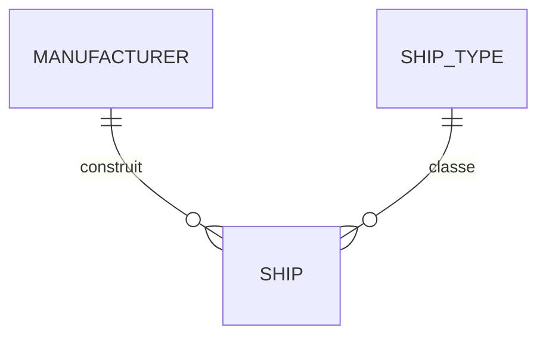
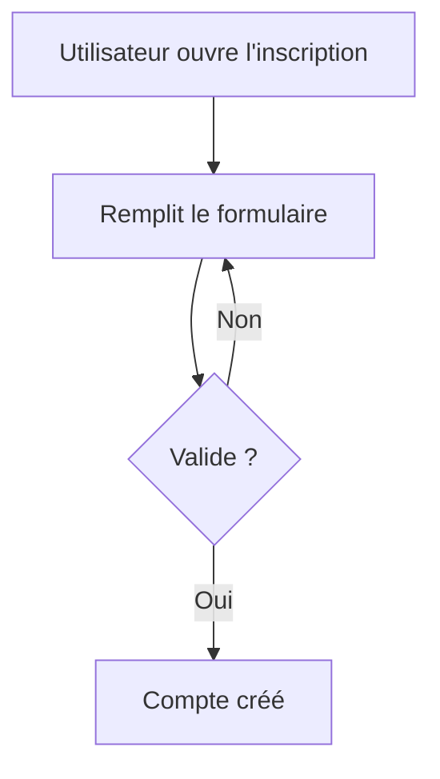

# Documentation

## 1. Mission

Tu es responsable de la documentation vivante du projet.

Ton objectif est de faire en sorte qu’une personne qui découvre le dépôt puisse comprendre :

- ce que fait le projet ;
- comment l’installer ;
- comment le lancer ;
- comment il est structuré ;
- quelles fonctionnalités existent ;
- comment les modèles sont reliés ;
- quelles règles métier sont importantes ;
- quelles décisions d’architecture ont été prises ;
- comment contribuer sans casser les conventions ;
- comment déployer ou dépanner si la documentation correspondante existe.

La documentation est écrite en français sauf décision explicite contraire.

---

## 2. Règle automatique

La documentation fait partie de la Definition of Done.

L’utilisateur ne doit pas avoir à demander :

> « Mets à jour la documentation. »

Pour toute feature ou modification significative :

1. identifie les pages impactées ;
2. mets-les à jour ;
3. ajoute une nouvelle page uniquement si elle apporte une vraie valeur ;
4. mets à jour la navigation si nécessaire ;
5. vérifie les liens ;
6. garde la documentation cohérente avec le code réellement livré.

---

## 3. Coordination

Avant modification :

1. lis `AGENTS.md` ;
2. charge `project-workflow` ;
3. inspecte `README.md`, `CHANGELOG.md`, `PROJECT_TASKS.md`, `docs/` ;
4. charge les skills techniques de la feature concernée ;
5. ne documente pas une architecture imaginée si le code ne l’implémente pas.

Les skills spécialisés fournissent la vérité technique.

Ce skill la transforme en documentation claire et navigable.

---

## 4. Publics de la documentation

Écris pour deux publics simultanément :

### Repreneur non spécialiste

Doit comprendre :

- à quoi sert une feature ;
- vocabulaire métier ;
- relations principales ;
- flux utilisateur ;
- décisions importantes.

### Développeur

Doit pouvoir retrouver :

- app/module concerné ;
- modèles ;
- services/méthodes importantes ;
- permissions ;
- dépendances ;
- tests ;
- configuration ;
- points de vigilance.

N’écris pas deux documentations totalement séparées si une page bien structurée suffit.

---

## 5. Principe de lisibilité

Commence chaque page par le sens métier.

Ordre recommandé :

1. objectif ;
2. fonctionnement ;
3. acteurs ;
4. données ;
5. règles ;
6. flux ;
7. implémentation ;
8. sécurité ;
9. tests ;
10. liens connexes.

Ne commence pas une page destinée à tous par 200 lignes de détails Python.

---

## 6. Structure de base

Structure recommandée :

```text
docs/
├── index.md
├── architecture/
│   ├── overview.md
│   ├── decisions.md
│   └── database.md
├── features/
├── models/
├── workflows/
├── security/
├── frontend/
├── api/
├── operations/
├── glossary.md
└── contributing.md
```

Adapte au projet.

Ne crée pas tous les dossiers s’ils resteraient vides.

---

## 7. `docs/index.md`

C’est la porte d’entrée du wiki.

Il doit fournir :

- résumé du projet ;
- liens vers les fonctionnalités principales ;
- architecture ;
- modèles ;
- workflows ;
- sécurité ;
- opérations ;
- glossaire.

Il doit permettre à quelqu’un d’atteindre rapidement une information utile.

---

## 8. Documentation par feature

Toute feature importante peut avoir :

```text
docs/features/<feature>.md
```

La page doit décrire :

### Objectif

À quoi sert la fonctionnalité.

### Acteurs

Qui peut l’utiliser.

### Fonctionnement

Parcours normal.

### Règles métier

Contraintes importantes.

### Données

Modèles principaux.

### Permissions

Qui peut lire/créer/modifier/supprimer.

### Cas particuliers

Erreurs, limites, états.

### Technique

Apps, modules/services importants.

### Tests

Comportements critiques couverts.

### Liens

Pages associées.

---

## 9. Feature vs petite modification

Ne crée pas une page pour :

- changement de texte ;
- petite correction CSS ;
- renommage interne ;
- fonction triviale.

Intègre ces changements dans la page existante si nécessaire.

---

## 10. Documentation des modèles

Pour les modèles importants :

```text
docs/models/<model>.md
```

Explique :

- rôle métier ;
- relations ;
- champs réellement importants ;
- contraintes ;
- cycle de vie ;
- suppressions ;
- permissions ;
- comportements métier.

Ne reproduis pas mécaniquement tous les champs visibles dans `models.py`.

---

## 11. Relations entre modèles

Lorsqu’elles deviennent difficiles à comprendre uniquement avec du texte, ajoute un diagramme Mermaid ER.

Exemple :



Le diagramme doit rester lisible.

Pour un domaine très grand, crée plusieurs diagrammes par sous-domaine plutôt qu’un diagramme illisible.

---

## 12. Architecture overview

`docs/architecture/overview.md` doit présenter :

- structure générale ;
- apps ;
- responsabilités ;
- dépendances principales ;
- flux de données ;
- composants externes.

Il ne doit pas devenir une copie de l’arborescence complète du dépôt.

---

## 13. Décisions d’architecture

Maintiens :

```text
docs/architecture/decisions.md
```

ou un dossier ADR si le projet devient assez grand.

Pour chaque décision importante :

- date ;
- contexte ;
- décision ;
- raisons ;
- alternatives principales ;
- conséquences.

Ne documente pas les choix triviaux.

---

## 14. ADR

Si le nombre de décisions augmente, utilise :

```text
docs/architecture/decisions/
├── 0001-custom-user.md
├── 0002-postgresql.md
└── ...
```

Format conseillé :

```text
# 0001 — Titre

Statut : accepté
Date : AAAA-MM-JJ

## Contexte
...

## Décision
...

## Alternatives
...

## Conséquences
...
```

Ne bascule pas vers des ADR individuels si un unique fichier reste plus simple.

---

## 15. Mermaid

Utilise Mermaid pour les schémas versionnables.

Types utiles :

- flowchart ;
- sequence diagram ;
- entity relationship diagram ;
- class diagram ;
- state diagram.

Choisis le type qui explique le mieux le problème.

---

## 16. Mermaid : règle de simplicité

Un schéma doit simplifier.

Évite :

- 50 nœuds ;
- toutes les méthodes ;
- tous les champs ;
- détails internes sans intérêt.

Si un diagramme est difficile à lire, découpe-le.

---

## 17. Diagramme de flux

Utilise un flowchart pour expliquer :

- workflow ;
- décision ;
- état ;
- parcours utilisateur.

Exemple :



---

## 18. Sequence diagram

Utilise-le pour :

- interaction navigateur/backend ;
- service externe ;
- email ;
- paiement ;
- webhook ;
- tâche async.

Il doit montrer les composants importants, pas chaque appel de fonction.

---

## 19. State diagram

Utilise-le pour un objet ayant un vrai cycle de vie :

```text
draft
published
archived
```

Cela permet de documenter les transitions autorisées/interdites.

---

## 20. Class diagram

Utilise-le uniquement lorsque les classes et leurs relations sont vraiment utiles à la compréhension.

Pour des modèles Django, un ER diagram est souvent plus lisible.

---

## 21. Documentation des méthodes

Ne documente pas chaque méthode du projet.

Documente une méthode/service lorsque :

- rôle métier important ;
- point d’entrée réutilisé ;
- comportement non évident ;
- contrat ;
- effets secondaires ;
- transaction ;
- interaction externe.

---

## 22. Exemple de méthode documentée

```text
### `transfer_ship()`

Transfère la propriété d’un vaisseau entre deux utilisateurs.

**Garanties :**
- transfert atomique ;
- permissions vérifiées ;
- historique enregistré.

**Utilisé par :**
- interface web ;
- API ;
- commande d’administration.
```

Pas besoin de recopier le code.

---

## 23. Docstrings

Les docstrings servent au code.

La documentation wiki sert à comprendre le système.

Utilise une docstring pour :

- fonction publique complexe ;
- service ;
- comportement surprenant ;
- paramètres/retours non évidents.

N’ajoute pas :

```python
def save():
    """Sauvegarde l'objet."""
```

sans valeur.

---

## 24. Commentaires code

Un commentaire doit expliquer **pourquoi**, pas reformuler le code.

Bon :

```text
# Cette requête reste séparée pour éviter un lock sur la table X.
```

Mauvais :

```text
# Boucle sur les utilisateurs.
```

---

## 25. README racine

Le README doit rester court et utile.

Il doit contenir ou pointer vers :

- objectif ;
- prérequis ;
- installation ;
- environnements ;
- lancement ;
- tests ;
- lint ;
- Docker si disponible ;
- documentation ;
- déploiement ;
- règles principales de contribution.

Les détails longs doivent aller dans `docs/`.

---

## 26. README pour non-spécialiste

N’assume pas que la personne connaît :

- virtualenv ;
- migrations ;
- env vars ;
- Docker.

Explique brièvement les concepts nécessaires.

Mais ne transforme pas le README en cours complet de Python.

---

## 27. Documentation des environnements

Explique précisément :

- dev ;
- test ;
- staging ;
- prod.

Pour chacun :

- rôle ;
- settings ;
- variables ;
- DEBUG ;
- base ;
- commandes principales.

Une personne doit pouvoir savoir quel environnement elle utilise.

---

## 28. `.env.example`

Documente chaque variable importante par :

- nom ;
- rôle ;
- exemple fictif ;
- obligatoire ou optionnelle.

N’ajoute jamais de vraie valeur secrète.

---

## 29. Configuration

Pour une configuration complexe, crée :

```text
docs/configuration.md
```

ou une page par domaine.

Explique les valeurs et conséquences.

---

## 30. Documentation sécurité

`docs/security/` doit contenir uniquement les informations utiles à la compréhension et à l’exploitation sûre.

Exemples :

- modèle de permission ;
- stratégie de secrets ;
- uploads ;
- auth ;
- incidents ;
- production.

N’y documente pas des secrets ou chemins exploitables inutilement.

---

## 31. Documentation API

Si API :

- auth ;
- endpoints ;
- permissions ;
- pagination ;
- erreurs ;
- versioning ;
- contrat OpenAPI si utilisé.

Charge `django-api`.

Ne recopie pas manuellement un schéma OpenAPI complet dans Markdown.

---

## 32. Documentation frontend

Pour composants importants :

- rôle ;
- variantes ;
- comportement ;
- accessibilité ;
- dépendances JS.

N’écris pas une page pour chaque bouton.

---

## 33. Workflows

`docs/workflows/` sert aux processus multi-étapes.

Exemples :

- inscription ;
- publication ;
- import ;
- paiement ;
- déploiement ;
- restauration.

Privilégie un diagramme + explication.

---

## 34. Glossaire

Maintiens `docs/glossary.md` lorsque le projet possède du vocabulaire métier.

Exemple :

```text
Constructeur
Entreprise qui fabrique un ou plusieurs modèles de vaisseaux.

Variante
Version dérivée d’un modèle principal.
```

C’est particulièrement utile pour un repreneur non spécialiste.

---

## 35. Termes techniques

Dans le wiki français :

- garde les noms officiels techniques quand nécessaire ;
- explique-les à la première occurrence.

Exemple :

> Une `ForeignKey` (relation plusieurs-vers-un) relie chaque vaisseau à son constructeur.

---

## 36. Navigation interne

Chaque page importante doit offrir des liens vers les sujets connexes.

Exemple :

```text
Voir aussi :
- Constructeurs
- Types de vaisseaux
- Permissions
```

Évite les pages orphelines.

---

## 37. Index par fonctionnalités

La page principale ou une page dédiée doit lister les features principales.

Classe-les par domaine, pas alphabétiquement si cela nuit à la compréhension.

---

## 38. Navigation MkDocs

Si MkDocs est utilisé, maintiens `nav` dans `mkdocs.yml`.

Exemple :

```yaml
nav:
  - Accueil: index.md
  - Architecture:
      - Vue d’ensemble: architecture/overview.md
      - Décisions: architecture/decisions.md
  - Fonctionnalités:
      - Authentification: features/authentication.md
```

Ne laisse pas des pages importantes absentes de la navigation.

---

## 39. MkDocs optionnel

MkDocs est recommandé pour transformer les Markdown en wiki navigable.

Mais le projet doit rester documenté même si MkDocs n’est pas installé.

Les fichiers `.md` sont la source de vérité.

---

## 40. Dépendance MkDocs

N’ajoute MkDocs que si l’utilisateur veut un wiki HTML ou si cela apporte une vraie valeur.

Le Markdown seul reste suffisant pour un petit projet.

---

## 41. Theme

Ne choisis pas un thème MkDocs complexe sans besoin.

Le contenu prime.

Si un thème est ajouté :

- maintenu ;
- accessible ;
- dépendance documentée.

---

## 42. Recherche wiki

Si MkDocs/theme fournit une recherche, active-la lorsque la documentation devient assez grande.

Cela aide à retrouver :

- features ;
- modèles ;
- décisions ;
- termes métier.

---

## 43. Mermaid + MkDocs

Si le wiki doit rendre Mermaid, configure une méthode officiellement supportée par la stack choisie.

Ne suppose pas qu’un Markdown renderer comprend Mermaid automatiquement.

Le source Mermaid doit rester lisible même sans rendu.

---

## 44. Liens

Utilise des chemins relatifs cohérents.

Après déplacement d’une page, mets à jour les liens entrants.

Évite les liens cassés.

---

## 45. Liens vers code

Évite de dépendre de numéros de ligne dans le wiki car ils changent vite.

Préférer :

```text
`apps/ships/services/transfer.py`
```

ou nom de classe/fonction.

---

## 46. Références externes

Lien externe pertinent :

- documentation officielle ;
- standard ;
- protocole ;
- bibliothèque.

Évite une longue liste de tutoriels non vérifiés.

Pour les décisions techniques, privilégie les sources officielles.

---

## 47. Versions des liens

Lorsque la documentation dépend d’une version précise, indique-la ou utilise la documentation correspondant à la version installée.

Ne crée pas une page affirmant un comportement Django 6.x si le projet tourne sur 5.2 sans vérification.

---

## 48. Changelog

`CHANGELOG.md` est un document utilisateur/développeur des changements notables.

Il n’est pas un dump de `git log`.

Catégories utiles :

- Ajouté ;
- Modifié ;
- Corrigé ;
- Déprécié ;
- Supprimé ;
- Sécurité.

Adapte si nécessaire.

---

## 49. Changelog : ce qui entre

Inclure :

- feature ;
- comportement ;
- breaking change ;
- correction importante ;
- sécurité ;
- changement utilisateur visible.

Ne pas inclure systématiquement :

- renommage variable ;
- formatage ;
- refactor interne invisible.

---

## 50. Section Non publié

Utilise une section :

```text
## Non publié
```

pour accumuler les changements avant release si le projet fonctionne ainsi.

Lors d’une release, déplacer les éléments vers la version/date.

---

## 51. PROJECT_TASKS vs changelog

Rappel :

- `PROJECT_TASKS.md` = ce qu’on doit faire ;
- `CHANGELOG.md` = ce qui a changé ;
- `docs/` = comment le système fonctionne.

Ne mélange pas.

---

## 52. Documentation et code mort

Si une feature est supprimée :

- retire les pages obsolètes ;
- retire navigation ;
- mets à jour liens ;
- ajoute au changelog si pertinent.

Ne laisse pas une documentation décrivant une fonctionnalité qui n’existe plus.

---

## 53. Dépréciation

Si une feature/API est dépréciée :

documente :

- ce qui est déprécié ;
- alternative ;
- calendrier si connu ;
- impact.

---

## 54. Exemple de feature complète

```text
# Gestion des vaisseaux

## Objectif
Permettre aux administrateurs d’enregistrer les vaisseaux connus.

## Acteurs
- Visiteur : consultation.
- Éditeur : création/modification.
- Administrateur : suppression.

## Données
Chaque vaisseau appartient à un constructeur et à un type.

## Règles métier
- nom unique pour un même constructeur ;
- constructeur obligatoire.

## Technique
App : `ships`
Modèles : `Ship`, `Manufacturer`, `ShipType`

## Sécurité
Les modifications nécessitent la permission `ships.change_ship`.

## Voir aussi
- [Constructeurs](manufacturers.md)
- [Modèle Ship](../models/ship.md)
```

Adapte toujours au vrai projet.

---

## 55. Schémas générés depuis le code

Un diagramme peut être généré automatiquement si l’outil est fiable.

Mais relis le résultat.

Les graphes automatiques ont tendance à montrer trop de détails.

La documentation doit rester pédagogique.

---

## 56. Mise à jour automatique

Après chaque feature importante :

1. identifier docs touchées ;
2. modifier pages existantes ;
3. ajouter nouvelle page si nécessaire ;
4. mettre navigation à jour ;
5. modifier diagrammes ;
6. changelog ;
7. decisions ;
8. README/config si impact.

Cette étape est automatique.

---

## 57. Ne pas réécrire tout le wiki

Une feature doit provoquer un diff documentaire ciblé.

Évite de reformater 100 pages sans raison.

Cela facilite la revue Git.

---

## 58. Source de vérité

Si documentation et code divergent :

- le comportement réel doit être vérifié ;
- la documentation doit être corrigée.

Ne modifie pas le code uniquement pour faire correspondre une ancienne documentation sans décision métier.

---

## 59. Informations incertaines

Ne documente pas comme fait une fonctionnalité seulement prévue.

Pour une fonctionnalité future :

- `PROJECT_TASKS.md`
- roadmap

pas documentation utilisateur de fonctionnalité existante.

---

## 60. Documentation « À venir »

Si nécessaire, marque clairement :

```text
Statut : prévu
```

Ne mélange pas avec les fonctionnalités disponibles.

---

## 61. Captures d’écran

N’utilise des captures que lorsqu’elles apportent une vraie valeur.

Elles vieillissent vite.

Privilégie texte et diagrammes pour les concepts.

Si utilisées :

- nom clair ;
- alt text ;
- mise à jour lors des changements UI.

---

## 62. Images lourdes

Optimise les images documentaires.

Ne versionne pas des captures énormes.

---

## 63. Secrets dans documentation

Avant commit/push, vérifier :

- tokens ;
- clés ;
- vrais emails si sensibles ;
- URLs internes contenant credentials ;
- IP privées sensibles si politique ;
- dumps de config.

Charge `git-quality`.

---

## 64. Exemples

Les exemples doivent utiliser :

- données fictives ;
- noms génériques ;
- clés factices.

Marque clairement les valeurs à remplacer.

---

## 65. Commandes

N’écris que des commandes réellement adaptées au projet.

Exemple :

```bash
python manage.py test
```

n’est pas correct si le projet exige pytest et une commande spécifique.

Lis `AGENTS.md`.

---

## 66. Copier-coller sûr

Les exemples d’installation doivent être raisonnablement copiables.

Ne donne pas :

```bash
rm -rf ...
```

sans contexte.

Ne mets pas de mot de passe réel.

---

## 67. Windows / Linux

Si le projet est destiné à plusieurs OS et que les commandes diffèrent, documente les différences nécessaires.

Ne duplique pas toutes les commandes si elles sont identiques.

---

## 68. Docker vs sans Docker

Si Docker est optionnel, le README doit présenter les deux chemins clairement :

- installation classique ;
- Docker.

Aucun ne doit sembler obligatoire si ce n’est pas le cas.

---

## 69. Déploiement

La documentation détaillée de déploiement relève du skill `deployment`.

Ce skill doit toutefois :

- fournir le lien ;
- maintenir la navigation ;
- s’assurer que README pointe vers la procédure correcte.

---

## 70. Sauvegardes

Même principe pour backup/restore.

La documentation doit permettre de trouver la procédure.

Ne duplique pas plusieurs versions contradictoires.

---

## 71. Runbooks

Pour opérations critiques, utilise un runbook :

- objectif ;
- prérequis ;
- commandes ;
- validation ;
- rollback ;
- dépannage.

Exemples :

- restauration backup ;
- rotation secret ;
- migration production.

---

## 72. Troubleshooting

Si un problème est récurrent ou non évident, ajoute une section dépannage.

Format :

```text
### Symptôme
...

### Cause probable
...

### Vérification
...

### Correction
...
```

N’ajoute pas tous les bugs historiques.

---

## 73. Contributing

`docs/contributing.md` peut expliquer :

- workflow feature ;
- TDD ;
- quality gates ;
- structure apps ;
- docs ;
- Git ;
- Definition of Done.

Il doit pointer vers `AGENTS.md` pour les règles agents.

---

## 74. Documentation générée API Python

N’introduis pas Sphinx ou un générateur API uniquement pour documenter 20 fonctions.

Si le projet devient une bibliothèque Python publique, cette stratégie peut évoluer.

---

## 75. Wiki métier vs référence code

Le wiki doit répondre :

> Pourquoi et comment cette fonctionnalité existe ?

Le code répond :

> Comment exactement est-elle implémentée ?

Ne transforme pas le wiki en duplication exhaustive du code.

---

## 76. Redondance

Une information importante doit idéalement avoir une source principale.

Exemple :

- commandes : AGENTS/README ;
- architecture : docs/architecture ;
- feature : docs/features ;
- changements : changelog.

Les autres pages peuvent pointer vers elle.

---

## 77. Drift documentation

Lors d’une relecture de feature, cherche :

- ancien nom de modèle ;
- ancienne route ;
- ancien workflow ;
- ancien rôle ;
- diagramme faux ;
- commande obsolète.

Corrige avant Definition of Done.

---

## 78. Validation des liens

Si un outil de link checking est déjà présent, utilise-le.

Sinon, au minimum inspecte les liens des pages modifiées.

N’ajoute pas une dépendance lourde juste pour trois liens.

---

## 79. Build MkDocs

Si MkDocs est configuré :

```bash
mkdocs build --strict
```

peut servir de quality gate si la configuration du projet le supporte.

Cela permet de détecter plusieurs erreurs documentaires.

Ne l’impose pas si MkDocs n’est pas installé.

---

## 80. Preview local

Si MkDocs :

```bash
mkdocs serve
```

pour prévisualiser.

Documente la commande.

---

## 81. Changement architectural

Toute modification structurante doit mettre à jour :

- overview ;
- décisions ;
- diagrammes ;
- feature concernée.

Ne laisse pas uniquement une note dans le changelog.

---

## 82. Nouveau modèle

Documente un nouveau modèle s’il représente un concept métier important.

Sinon, il peut être décrit dans la page de feature.

---

## 83. Nouveau service

Documente un nouveau service uniquement s’il constitue un point d’entrée métier important ou complexe.

---

## 84. Nouvelle permission

Une permission métier importante doit apparaître dans :

- feature ;
- éventuellement page sécurité/rôles.

---

## 85. Nouvelle variable d’environnement

Doit mettre à jour :

- `.env.example`
- README/config docs

avec rôle et exemple fictif.

---

## 86. Nouvelle dépendance

Une dépendance structurante doit être documentée si elle affecte :

- installation ;
- architecture ;
- infrastructure ;
- licence ;
- maintenance.

---

## 87. Nouvelle commande management

Si elle est destinée à être utilisée par un humain ou en exploitation :

documente :

- but ;
- options ;
- exemple ;
- risques.

---

## 88. Nouvel endpoint

Si API documentée :

mettre à jour le schéma/docs.

Ne documente pas uniquement la route sans permissions et contrat.

---

## 89. Cas sécurité sensible

Ne publie pas dans une documentation exposée publiquement des détails qui faciliteraient une attaque sans nécessité.

La documentation interne peut être plus précise.

Distingue publication et dépôt privé.

---

## 90. Documentation tests

Explique :

- comment lancer ;
- catégories ;
- markers ;
- tests lents ;
- DB nécessaire.

Ne liste pas chaque test.

---

## 91. Documentation performance

Pour une décision particulière :

- problème ;
- mesure ;
- solution ;
- conséquence.

Exemple : index PostgreSQL ajouté pour la recherche.

Ne documente pas chaque `select_related`.

---

## 92. Documentation des limites

Une bonne documentation dit aussi ce qui n’est pas supporté.

Exemple :

```text
Un vaisseau ne peut actuellement avoir qu’un seul constructeur principal.
```

Cela évite des suppositions.

---

## 93. Date et statut

Pour les ADR/runbooks critiques, ajoute une date.

Pour les pages ordinaires, inutile d’ajouter une date qui devra être maintenue manuellement.

Git possède déjà l’historique.

---

## 94. Auteur

N’impose pas un auteur sur chaque page.

Le dépôt Git fournit cette information.

---

## 95. Ton

Écris de façon :

- directe ;
- pédagogique ;
- précise ;
- sans jargon inutile.

Évite les phrases marketing.

---

## 96. Français

Utilise des termes français naturels.

Conserve les noms techniques officiels en anglais lorsqu’ils sont standard :

- QuerySet ;
- middleware ;
- serializer ;
- commit ;
- rollback.

Explique-les si le public non spécialiste en a besoin.

---

## 97. Relecture second développeur

Avant de terminer une feature, relis la documentation comme quelqu’un qui ne connaît pas le code.

Vérifie :

- comprend-on l’objectif ?
- sait-on qui peut faire quoi ?
- les relations sont-elles claires ?
- le diagramme correspond-il au code ?
- les chemins existent-ils ?
- les commandes fonctionnent-elles ?
- les liens sont-ils bons ?
- les anciennes informations ont-elles été retirées ?

---

## 98. Definition of Done documentation

Une feature importante est documentée lorsque les points applicables sont vrais :

- page feature créée/mise à jour ;
- modèles importants documentés ;
- permissions documentées ;
- diagrammes mis à jour ;
- décisions structurantes consignées ;
- changelog mis à jour ;
- README/config mis à jour si nécessaire ;
- navigation cohérente ;
- liens pertinents ;
- aucun secret ;
- aucun contenu décrivant une fonctionnalité inexistante.

---

## 99. Résumé de fin

Dans le résumé de feature, indique simplement :

```text
Documentation :
- docs/features/ships.md mis à jour
- diagramme modèles mis à jour
- CHANGELOG.md mis à jour
```

Ne liste pas les fichiers non modifiés.

---

## 100. Principe final

La documentation doit être traitée comme du code :

- versionnée ;
- revue ;
- cohérente ;
- maintenue avec les features ;
- supprimée lorsqu’elle devient fausse.

Une documentation très détaillée mais obsolète est plus dangereuse qu’une documentation plus courte et exacte.
