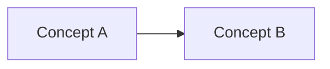

# Nom de la fonctionnalité

## Objectif

Expliquer simplement à quoi sert la fonctionnalité.

## Acteurs

- **Visiteur :** ...
- **Utilisateur :** ...
- **Administrateur :** ...

## Fonctionnement

Décrire le parcours principal.

## Règles métier

- ...
- ...

## Données et relations

Décrire les principaux modèles.

## Permissions

Décrire qui peut lire, créer, modifier ou supprimer.

## Cas particuliers

- ...

## Implémentation

- **App Django :** `...`
- **Modèles :** `...`
- **Services importants :** `...`

## Tests importants

- ...

## Voir aussi

- [...]
