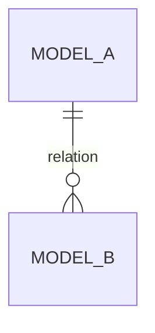

# Modèle — Nom

## Rôle métier

Décrire ce que représente ce modèle.

## Relations

## Données importantes

| Élément | Rôle |
|---|---|
| ... | ... |

## Contraintes

- ...

## Cycle de vie

- ...

## Permissions / confidentialité

- ...

## Utilisé par

- ...
