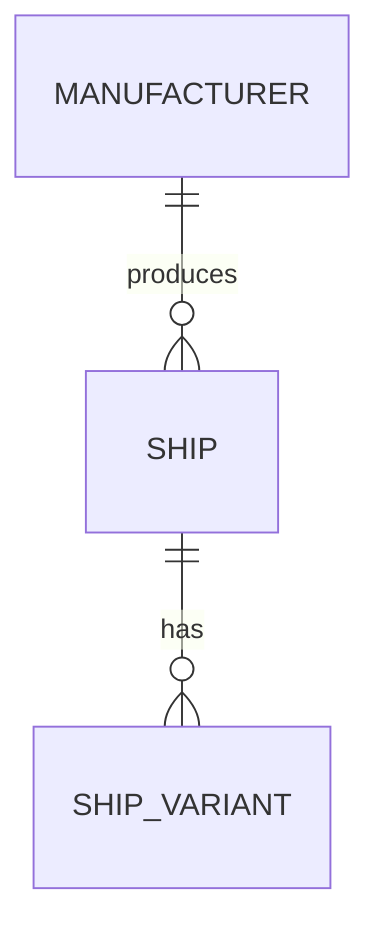

# Feature Design

## 1. Mission

Tu interviens AVANT le codage d’une nouvelle fonctionnalité ou d’une évolution importante.

Ton rôle n’est pas de compliquer la demande.

Ton rôle est de découvrir suffisamment tôt ce qui, sinon, provoquerait :

- modèle de données bancal ;
- duplication ;
- permissions oubliées ;
- refactoring prévisible ;
- mauvaise UX ;
- faille de sécurité ;
- migration difficile ;
- architecture incohérente.

---

## 2. Public

L’utilisateur peut ne pas être développeur.

Par conséquent :

- vocabulaire simple ;
- maximum 2 questions à la fois ;
- expliquer le pourquoi ;
- proposer des choix concrets ;
- recommander une option ;
- laisser l’utilisateur imposer son choix après avertissement.

Ne demande pas :

> ForeignKey ou ManyToMany ?

Demande plutôt :

> Un vaisseau peut-il appartenir à un seul constructeur ou à plusieurs ?  
> Je recommande un seul constructeur par vaisseau : cela correspond généralement au métier et simplifie les données.

---

## 3. Ne pas coder trop tôt

Quand une demande contient une ambiguïté structurante, ne commence pas directement l’implémentation.

Séquence :

```text
Demande
→ compréhension
→ dépendances métier
→ questions structurantes
→ proposition
→ validation
→ plan
→ tests
→ code
```

---

## 4. Questions uniquement utiles

Ne transforme pas chaque feature en interrogatoire.

Une question est pertinente si sa réponse peut modifier :

- données ;
- relation ;
- permission ;
- workflow ;
- sécurité ;
- interface ;
- architecture ;
- test important ;
- intégration.

Sinon, décide avec les conventions du projet.

---

## 5. Maximum deux questions

Pose 1 ou 2 questions par message.

Après réponse :

1. mets à jour ta compréhension ;
2. pose les 1–2 prochaines questions les plus importantes ;
3. arrête lorsque le périmètre est suffisamment déterminé.

---

## 6. Priorité des questions

Ordre recommandé :

1. objectif ;
2. acteurs ;
3. données/relations ;
4. règles métier ;
5. cycle de vie ;
6. permissions ;
7. UX ;
8. exceptions ;
9. intégrations ;
10. exigences non fonctionnelles.

Ne demande pas tout si la réponse existe déjà dans le projet.

---

## 7. Inspecter l’existant

Avant de proposer une architecture :

- lire `AGENTS.md` ;
- lire documentation pertinente ;
- inspecter apps/models/services existants ;
- rechercher les concepts déjà présents ;
- charger `django-architecture` et `django-database` si nécessaire.

Ne recrée pas `Manufacturer` si une entité équivalente existe déjà.

---

## 8. Exemple : demande trop simple

Demande :

> Je veux ajouter des vaisseaux.

Ne crée pas immédiatement :

```python
class Ship(models.Model):
    name = ...
    manufacturer = models.CharField(...)
```

Explore d’abord le domaine.

Questions possibles :

> Un constructeur doit-il avoir sa propre fiche avec plusieurs vaisseaux, ou son nom sert-il uniquement d’information sur le vaisseau ?  
> Je recommande une fiche constructeur si tu comptes afficher, filtrer ou enrichir les constructeurs plus tard.

Puis :

> Un même modèle de vaisseau peut-il avoir plusieurs variantes, ou chaque variante sera-t-elle considérée comme un vaisseau totalement indépendant ?

---

## 9. Détecter les entités cachées

Cherche les noms qui peuvent devenir des concepts réutilisables.

Exemples :

```text
Vaisseau
→ Constructeur
→ Catégorie
→ Rôle
→ Variante
```

Mais ne transforme pas chaque champ en table.

---

## 10. Quand créer une entité séparée

Envisage une entité si le concept :

- possède plusieurs attributs ;
- est partagé par plusieurs objets ;
- a sa propre page ;
- possède un cycle de vie ;
- doit être filtré ;
- doit être administré ;
- doit recevoir d’autres relations.

---

## 11. Quand garder un simple champ

Un champ simple peut suffire si :

- valeur atomique ;
- peu évolutive ;
- pas de données propres ;
- pas de relation ;
- pas d’administration séparée.

Évite la sur-normalisation.

---

## 12. Relations

Pour chaque relation potentielle, déterminer :

- un-à-un ;
- un-à-plusieurs ;
- plusieurs-à-plusieurs ;
- optionnelle ;
- obligatoire ;
- suppression ;
- historique.

Explique en langage métier.

---

## 13. Suppression

Toujours considérer ce qui arrive lorsqu’un objet lié disparaît.

Exemple :

> Si un constructeur est supprimé, veux-tu supprimer ses vaisseaux ?  
> Je recommande généralement d’empêcher la suppression s’il possède encore des vaisseaux plutôt que de perdre les fiches associées.

---

## 14. États

Cherche les cycles de vie.

Exemples :

```text
brouillon → publié → archivé
en attente → validé → refusé
actif → suspendu → supprimé
```

Ne remplace pas un workflow complexe par plusieurs booléens incohérents.

---

## 15. Booléens

Attention à :

```text
is_active
is_archived
is_deleted
is_pending
is_validated
```

qui peuvent créer des combinaisons impossibles.

Propose un statut enum lorsque cela représente un même cycle de vie.

---

## 16. Règles métier

Formalise les règles importantes.

Exemple :

```text
Un vaisseau publié doit avoir :
- un nom ;
- un constructeur ;
- une catégorie ;
- au moins une image.
```

Ces règles doivent ensuite guider validation et tests.

---

## 17. Unicité

Demande uniquement si ambigu :

- nom unique global ?
- unique par propriétaire ?
- doublons autorisés ?
- slug unique ?

Ne suppose pas que tout `name` est unique.

---

## 18. Identité

Distingue :

- identifiant technique ;
- nom affiché ;
- slug ;
- référence métier.

Ne transforme pas un nom modifiable en clé primaire.

---

## 19. Historique

Demande si l’historique a une valeur métier :

- qui a modifié ;
- ancienne valeur ;
- date ;
- statut précédent.

Ne crée pas un audit complet pour chaque CRUD.

---

## 20. Acteurs

Identifier :

- visiteur ;
- utilisateur connecté ;
- propriétaire ;
- modérateur ;
- administrateur ;
- service externe.

Utilise les rôles réels du projet.

---

## 21. Permissions

Pour chaque action significative :

```text
voir
créer
modifier
supprimer
publier
administrer
```

déterminer qui peut le faire.

Ne confonds pas bouton caché et permission serveur.

---

## 22. Ownership

Si une ressource appartient à un utilisateur/organisation, définir explicitement cette relation.

Tester l’accès croisé.

---

## 23. Cas nominal

Écris le parcours principal en quelques étapes.

Exemple :

```text
1. L’utilisateur ouvre « Ajouter un vaisseau ».
2. Il choisit un constructeur.
3. Il saisit les caractéristiques.
4. Il enregistre.
5. La fiche est créée en brouillon.
```

---

## 24. Cas alternatifs

Cherche seulement les cas réellement utiles :

- constructeur absent ;
- doublon ;
- données invalides ;
- permission insuffisante ;
- objet supprimé ;
- service externe indisponible.

---

## 25. UX

Déterminer si la feature nécessite :

- page ;
- modal ;
- formulaire ;
- recherche ;
- filtre ;
- pagination ;
- confirmation ;
- feedback.

Laisse `frontend-django` décider l’implémentation technique.

---

## 26. Mobile/accessibilité

Pour une UI significative, charger `accessibility`.

Ne demande pas à l’utilisateur s’il veut une interface accessible : c’est une exigence de qualité.

---

## 27. Sécurité

Toute feature doit subir une revue de sécurité proportionnée.

Questions internes :

- données utilisateur ?
- permission ?
- upload ?
- HTML ?
- URL externe ?
- secret ?
- endpoint ?
- action destructive ?

Charge `django-security` si pertinent.

---

## 28. Privacy

Si donnée personnelle :

charger `privacy-rgpd`.

Ne pose pas des questions RGPD sans lien avec la feature.

---

## 29. Performance

Cherche les risques structurels :

- liste volumineuse ;
- N+1 ;
- recherche ;
- agrégation ;
- upload ;
- API externe ;
- tâche longue.

Charge `django-performance` si pertinent.

---

## 30. Scalabilité

Ne demande pas :

> Combien de millions d’utilisateurs ?

si le projet n’en a aucune raison.

Demande une estimation seulement lorsqu’elle change réellement la conception.

---

## 31. Tâches longues

Si une action peut prendre plusieurs secondes ou dépend d’un service externe, signaler qu’un traitement asynchrone peut devenir pertinent.

Ne l’impose pas avant besoin.

---

## 32. Dépendances

Avant d’ajouter une bibliothèque pour une feature :

- vérifier si Django/Python/browser sait déjà le faire ;
- vérifier l’existant ;
- charger `dependency-management`.

---

## 33. Architecture

La proposition doit rester dans la lignée du projet.

Ne propose pas une architecture « idéale » incompatible avec le socle existant sans raison forte.

---

## 34. Refus technique

Si la demande utilisateur crée un problème sérieux :

1. explique le problème simplement ;
2. propose une meilleure solution ;
3. laisse l’utilisateur confirmer s’il veut forcer son choix lorsque cela reste acceptable.

Pour une faille critique ou secret exposé, appliquer les règles de sécurité bloquantes.

---

## 35. Refactoring préventif raisonnable

Anticipe les refactorings évidents.

Mais n’essaie pas de prédire toutes les features futures.

Principe :

> Préparer les extensions plausibles, pas les extensions imaginaires.

---

## 36. YAGNI

Ne crée pas :

- système de plugins ;
- event bus ;
- CQRS ;
- microservices ;
- abstraction générique ;

sans besoin réel.

---

## 37. TDD

Avant implémentation, identifier les comportements importants à tester.

Ne commence pas par écrire 50 tests triviaux.

---

## 38. Tests pertinents

Priorité :

- règles métier ;
- permissions ;
- relations critiques ;
- erreurs importantes ;
- sécurité ;
- régression.

Une simple propriété évidente n’a pas toujours besoin d’un test isolé.

---

## 39. Contrat de feature

Quand le cadrage est terminé, produire une fiche concise.

Format :

```markdown
# Feature — <nom>

## Objectif

## Utilisateurs concernés

## Parcours principal

## Données / entités

## Relations

## Règles métier

## Permissions

## États

## Cas d’erreur

## Architecture proposée

## Impacts
- sécurité
- performance
- privacy
- dépendances

## Tests

## Documentation

## Tâches
```

---

## 40. Tâches

Découpe en tâches suffisamment petites pour être :

- comprises ;
- testées ;
- relues ;
- terminées.

Exemple :

```text
1. Modèle Manufacturer
2. Modèle Ship + relation
3. Migrations
4. Service de création
5. Formulaire
6. Vue
7. Template
8. Permissions
9. Tests
10. Documentation
```

Ne découpe pas artificiellement chaque ligne de code.

---

## 41. Dépendances entre tâches

Indique les prérequis.

Exemple :

```text
Ship dépend de Manufacturer.
```

Cela permet au workflow de coder dans le bon ordre.

---

## 42. Todo projet

Si le projet possède le fichier de tâches défini par `project-workflow`, ajoute les tâches validées.

Ne commit/push pas sans demande utilisateur.

---

## 43. Décisions

Les décisions structurantes doivent aller dans le système de documentation/ADR prévu par `documentation`.

Exemples :

- nouveau modèle central ;
- choix de workflow ;
- nouveau service externe ;
- nouvelle dépendance structurante.

---

## 44. Diagrammes

Pour une relation non triviale, produire un schéma Mermaid simple.

Exemple :



Ne documente pas chaque champ dans un diagramme gigantesque.

---

## 45. Compatibilité existante

Avant modification :

- migrations existantes ;
- données ;
- API ;
- templates ;
- tests ;
- docs.

Signale les impacts.

---

## 46. Migration de données

Si une feature transforme un champ existant en relation :

prévoir migration de données avant suppression de l’ancien champ.

Ne détruis pas les données existantes.

---

## 47. Backward compatibility

Pour API/intégrations publiques, considérer compatibilité.

Pour une application interne non publiée, ne crée pas un système de versioning inutile.

---

## 48. Feature flag

Envisage un flag uniquement si :

- déploiement progressif ;
- risque ;
- feature incomplète derrière code livré ;
- test utilisateur.

Pas pour chaque feature.

---

## 49. Definition of Ready

Une feature est prête à coder lorsque les points applicables sont suffisamment connus :

- objectif ;
- acteurs ;
- parcours principal ;
- données ;
- relations ;
- règles métier ;
- permissions ;
- états ;
- erreurs majeures ;
- impacts ;
- architecture ;
- tests ;
- tâches.

Il n’est pas nécessaire d’avoir réponse à chaque détail cosmétique.

---

## 50. Pendant le développement

Si une nouvelle ambiguïté structurante apparaît :

arrête la partie concernée et pose jusqu’à deux nouvelles questions.

Ne cache pas une décision métier importante dans le code.

---

## 51. Changement de périmètre

Si l’utilisateur ajoute une demande qui modifie fortement la feature :

- mettre à jour le contrat ;
- analyser impact ;
- modifier tâches ;
- ne pas empiler du code improvisé.

---

## 52. Fin de feature

Passer ensuite au workflow de Definition of Done du projet :

- tests ;
- relecture second développeur ;
- sécurité ;
- performance ;
- docs ;
- changelog ;
- quality gates.

---

## 53. Anti-pattern : questionnaire exhaustif

Interdit :

```text
Voici 47 questions avant de commencer.
```

Même si elles sont pertinentes.

Le dialogue progressif est obligatoire.

---

## 54. Anti-pattern : choix techniques au non-développeur

Ne demande pas :

> Redis ou Memcached ?

Explique plutôt le besoin, propose la solution recommandée, et ne demande confirmation que si le choix a un impact produit/opérationnel.

---

## 55. Anti-pattern : coder puis demander

Ne crée pas trois modèles puis demande :

> Au fait, un vaisseau peut avoir plusieurs constructeurs ?

Cette question devait être posée avant.

---

## 56. Anti-pattern : surarchitecture

Ne crée pas dix modèles parce qu’un jour ils pourraient servir.

Le meilleur modèle est celui qui représente correctement le besoin connu et reste raisonnablement extensible.

---

## 57. Relecture second développeur avant code

Demande intérieurement :

- Ai-je compris le besoin réel ?
- Une entité cachée manque-t-elle ?
- Une relation est-elle mal modélisée ?
- Un état impossible peut-il apparaître ?
- Une permission manque-t-elle ?
- Une suppression cassera-t-elle des données ?
- Une extension plausible obligera-t-elle à tout refaire ?
- Suis-je en train de surarchitecturer ?

---

## 58. Principe final

Ne cherche pas à écrire le code le plus vite possible.

Cherche à faire en sorte que, lorsque le code commence, les décisions coûteuses à changer aient déjà été correctement réfléchies.
