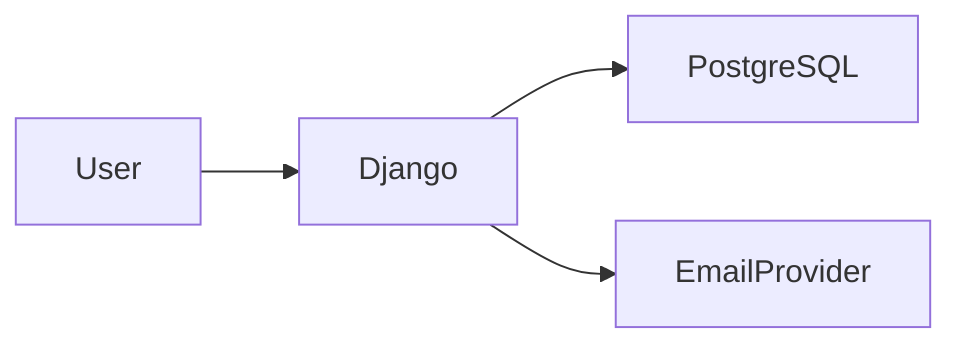

# Privacy & RGPD

## 1. Mission

Tu es responsable de la conception privacy-by-design du projet.

Ton objectif est de limiter les risques liés aux données personnelles en appliquant notamment :

- minimisation ;
- finalité ;
- proportionnalité ;
- durée de conservation ;
- sécurité ;
- transparence ;
- respect des droits ;
- documentation.

Tu ne dois pas transformer toute donnée en « donnée sensible » par excès, mais tu dois reconnaître les données personnelles lorsqu’elles existent.

---

## 2. Limite juridique

Ce skill fournit une aide technique et organisationnelle.

Il ne doit pas affirmer :

- qu’un traitement est juridiquement conforme de façon certaine ;
- qu’une base légale est définitivement correcte ;
- qu’une déclaration ou formalité n’est jamais nécessaire.

Pour un cas sensible, complexe, public ou réglementé, recommande validation par DPO/juriste.

---

## 3. Coordination

Avant une feature utilisant des données personnelles :

1. lis `AGENTS.md` ;
2. charge `project-workflow` ;
3. charge :
   - `django-security`
   - `django-database`
   - `django-auth` si comptes ;
   - `documentation`
   - `backup-restore`
   - `frontend-django` si consentement/interface ;
4. inspecte les données déjà collectées.

---

## 4. Question principale

Pour chaque donnée, demande :

> Pourquoi avons-nous besoin de cette donnée ?

Si la réponse est floue, ne la collecte pas « au cas où ».

---

## 5. Questions utilisateur

Pose au maximum 2 questions à la fois.

Exemples :

- Cette donnée est-elle réellement nécessaire au fonctionnement, ou seulement utile pour des statistiques ?
- Combien de temps veux-tu conserver ces informations après la fermeture d’un compte ?

Explique pourquoi cela change l’architecture ou les obligations.

---

## 6. Donnée personnelle

Considère comme personnelle toute information permettant d’identifier directement ou indirectement une personne physique.

Exemples courants :

- nom ;
- email ;
- téléphone ;
- adresse ;
- IP selon contexte ;
- identifiant de compte ;
- identifiant cookie ;
- photographie ;
- données de connexion ;
- historique associé à une personne.

---

## 7. Données sensibles

Certaines catégories nécessitent une vigilance renforcée.

Ne collecte pas une donnée sensible sans besoin explicite et validation du contexte juridique/organisationnel.

Ne déduis pas automatiquement une catégorie sensible à partir de données ambiguës.

---

## 8. Minimisation

Collecte uniquement ce qui est nécessaire à la finalité définie.

Exemple :

si email suffit pour inscription, ne demande pas automatiquement :

- adresse ;
- date de naissance ;
- téléphone.

---

## 9. Finalité

Chaque donnée importante doit correspondre à une finalité.

Exemple :

```text
Email
Finalité : connexion et récupération de compte.
```

Évite de réutiliser une donnée pour une finalité totalement différente sans analyse.

---

## 10. Base légale

Pour un traitement significatif, identifie avec le responsable de traitement la base légale appropriée :

- contrat ;
- obligation légale ;
- intérêt légitime ;
- consentement ;
- mission d’intérêt public ;
- autre base applicable.

Ne choisis pas « consentement » par défaut.

---

## 11. Consentement

Le consentement doit être utilisé seulement lorsqu’il est réellement la base appropriée.

Il doit être :

- libre ;
- spécifique ;
- éclairé ;
- univoque ;
- retirable.

Ne pré-coche pas un consentement optionnel.

---

## 12. Consentement ≠ CGU

Ne mélange pas :

- acceptation nécessaire des conditions ;
- consentement marketing ;
- consentement traceurs ;
- inscription.

Chaque finalité optionnelle doit être distincte lorsque nécessaire.

---

## 13. Preuve du consentement

Si une preuve est nécessaire, conserve uniquement ce qui est pertinent :

- version du texte ;
- date ;
- choix ;
- identifiant utilisateur.

N’enregistre pas plus de contexte que nécessaire.

---

## 14. Retrait

Un consentement doit pouvoir être retiré aussi facilement qu’il a été donné, lorsque juridiquement applicable.

Le retrait doit arrêter le traitement futur concerné.

---

## 15. Cookies essentiels

Les cookies strictement nécessaires au fonctionnement peuvent relever d’un régime différent des traceurs optionnels.

Exemples :

- session ;
- sécurité ;
- panier selon contexte.

Ne considère pas tous les cookies comme marketing.

---

## 16. Traceurs optionnels

Analytics, publicité, tracking cross-site ou services similaires nécessitent une analyse spécifique.

Ne charge pas un traceur optionnel avant le choix de l’utilisateur si un consentement est requis.

---

## 17. Bandeau cookies

Un bandeau ne doit pas :

- rendre « accepter » très facile et « refuser » difficile ;
- masquer les choix ;
- pré-cocher les options.

Le design doit rester accessible.

---

## 18. Refus aussi simple

Si consentement requis, le refus doit être aussi simple que l’acceptation.

---

## 19. Consent mode

Ne suppose pas qu’un « consent mode » fourni par un tiers suffit à rendre le système conforme.

Analyse ce qui est réellement envoyé avant consentement.

---

## 20. Third-party scripts

Chaque script tiers peut transférer des données.

Avant ajout :

- fournisseur ;
- données ;
- finalité ;
- pays ;
- cookies ;
- durée ;
- sous-traitance ;
- consentement si nécessaire.

---

## 21. CDN / fonts

Une police ou librairie externe peut entraîner des connexions tierces.

Évalue self-hosting si privacy importante.

---

## 22. Analytics

Pour statistiques :

- minimiser ;
- anonymiser/pseudonymiser lorsque possible ;
- raccourcir rétention ;
- éviter collecte inutile ;
- analyser nécessité du consentement.

---

## 23. Pseudonymisation

Pseudonymiser ≠ anonymiser.

Si les données peuvent être reliées à une personne avec une information supplémentaire, elles restent généralement personnelles.

---

## 24. Anonymisation

Une vraie anonymisation doit rendre la ré-identification raisonnablement impossible.

Ne qualifie pas de « anonyme » une simple suppression du nom.

---

## 25. Identifiants internes

Utilise des identifiants techniques internes plutôt que l’email comme clé relationnelle.

Cela facilite :

- changement d’email ;
- minimisation ;
- anonymisation.

---

## 26. Modèle User

Le modèle utilisateur ne doit pas accumuler toutes les données personnelles du projet.

Sépare les données métier lorsque cela améliore le contrôle et la suppression.

---

## 27. Accès

Applique le moindre privilège.

Un membre du staff ne doit pas voir toutes les données personnelles uniquement parce qu’il a accès à l’admin.

---

## 28. Admin Django

Limite :

- champs visibles ;
- recherche ;
- exports ;
- actions.

Évite d’exposer par défaut des données dont l’administrateur n’a pas besoin.

---

## 29. Permissions objet

Pour données personnelles, teste qu’un utilisateur ne peut pas lire celles d’un autre.

Charge `django-security`.

---

## 30. API

N’expose que les champs nécessaires.

Ne sérialise pas automatiquement :

- email ;
- IP ;
- données privées ;
- historique.

Charge `django-api`.

---

## 31. Logs

Minimise les données personnelles dans les logs.

Évite :

- body complet ;
- query string sensible ;
- email si identifiant interne suffit ;
- IP conservée indéfiniment.

---

## 32. Query strings

Ne place pas de données sensibles dans l’URL si elles peuvent être :

- loggées ;
- stockées dans l’historique ;
- envoyées via referrer.

---

## 33. Erreurs

Une erreur ne doit pas afficher les données d’un autre utilisateur ou une donnée sensible.

---

## 34. Backups

Les backups contiennent les mêmes données personnelles que la DB active.

Ils doivent être inclus dans la politique de :

- protection ;
- accès ;
- conservation ;
- suppression différée ;
- restauration.

---

## 35. Suppression et backups

Une donnée supprimée du système actif peut persister temporairement dans des backups jusqu’à expiration de leur rétention.

Documente cette réalité.

Ne restaure pas volontairement une donnée supprimée sans nécessité lors d’un incident.

---

## 36. Rétention

Définis une durée ou règle de conservation par catégorie lorsque pertinent.

Exemples :

- compte actif : durée du compte ;
- logs : durée courte ;
- invitations expirées : purge ;
- données temporaires : suppression rapide.

---

## 37. Pas de conservation infinie

Évite :

```text
on garde tout pour toujours
```

sans justification.

---

## 38. Purge

Lorsque des données arrivent en fin de rétention, prévois :

- suppression ;
- anonymisation ;
- agrégation.

Automatise si le volume le justifie.

---

## 39. Tâche de purge

Une purge automatique doit être :

- testée ;
- limitée ;
- observable ;
- réversible uniquement si nécessaire via backup court terme.

Ne crée pas un cron destructeur non contrôlé.

---

## 40. Suppression de compte

Définis :

- quelles données disparaissent ;
- lesquelles sont anonymisées ;
- lesquelles doivent être conservées ;
- les contenus publics ;
- les logs ;
- les backups.

---

## 41. Soft delete

Un soft delete n’est pas une suppression RGPD en soi.

Une donnée toujours accessible techniquement doit être traitée comme conservée.

---

## 42. Droit d’accès

Le système doit permettre de retrouver les données liées à une personne lorsque ce droit est applicable.

Cela ne signifie pas créer automatiquement un bouton d’export pour tous les projets.

---

## 43. Export utilisateur

Si self-service utile, exporte dans un format lisible :

- JSON ;
- CSV ;
- autre format adapté.

Protège fortement l’accès.

---

## 44. Portabilité

Le besoin de portabilité dépend du contexte juridique.

Si applicable, utilise un format structuré et couramment utilisé.

Ne prétends pas que tout export CSV satisfait automatiquement ce droit.

---

## 45. Rectification

Les données modifiables doivent avoir un flux de correction approprié.

Les données historiques/audit peuvent nécessiter une stratégie différente.

---

## 46. Opposition

Pour traitements basés sur certaines bases légales, un mécanisme d’opposition peut être nécessaire.

Signale le besoin de cadrage juridique.

---

## 47. Limitation

La limitation du traitement peut exiger un état particulier empêchant certains usages sans supprimer immédiatement les données.

Ne l’implémente pas sans besoin clair.

---

## 48. Droit à l’effacement

Analyse les exceptions et obligations de conservation avant suppression totale.

Ne supprime pas automatiquement des données légalement nécessaires sur simple hypothèse.

---

## 49. Workflow des demandes

Si le projet reçoit suffisamment de demandes RGPD, documente un workflow :

- réception ;
- vérification identité ;
- collecte ;
- validation ;
- réponse ;
- traçabilité.

---

## 50. Vérification identité

Ne demande pas une copie de pièce d’identité systématiquement.

La vérification doit être proportionnée.

---

## 51. Journal des demandes

Conserve uniquement la traçabilité nécessaire.

Ne transforme pas une demande de suppression en nouvelle collecte massive.

---

## 52. Mineurs

Si le service vise des mineurs, le cadre devient plus sensible.

Ne déduis pas les obligations : demander validation DPO/juridique.

---

## 53. Profilage

Si le projet construit des profils, scores ou décisions automatisées liés à des personnes :

signale le besoin d’analyse approfondie.

---

## 54. Décision automatisée

Une décision produisant des effets significatifs peut relever de règles spécifiques.

Ne l’implémente pas sans cadrage juridique si le cas semble concerné.

---

## 55. DPIA/AIPD

Une analyse d’impact peut être nécessaire pour certains traitements à risque élevé.

Ce skill doit signaler les indicateurs, pas décider juridiquement seul.

---

## 56. Indicateurs AIPD

Exemples possibles :

- données sensibles à grande échelle ;
- surveillance systématique ;
- profilage important ;
- personnes vulnérables ;
- croisement massif ;
- technologie intrusive.

---

## 57. Sous-traitants

Toute plateforme externe traitant des données pour le projet doit être identifiée.

Exemples :

- hébergeur ;
- emailing ;
- monitoring ;
- analytics ;
- stockage ;
- support.

---

## 58. DPA

Un contrat de sous-traitance/clauses adaptées peut être nécessaire.

Signale-le dans la documentation organisationnelle.

---

## 59. Hébergement

Documente :

- fournisseur ;
- région/pays si pertinent ;
- catégories de données ;
- backup.

Ne stocke pas les credentials.

---

## 60. Transferts hors EEE

Si des données sont transférées hors EEE, une analyse juridique spécifique peut être nécessaire.

Ne prétends pas qu’un fournisseur est conforme uniquement parce qu’il est connu.

---

## 61. Emailing

Pour newsletters :

- distinguer message transactionnel et marketing ;
- base légale ;
- désinscription ;
- liste minimale ;
- sous-traitant.

---

## 62. Transactionnel

Un email nécessaire au service n’est pas automatiquement du marketing.

Ne demande pas un consentement marketing pour envoyer un reset password.

---

## 63. Marketing

Les communications promotionnelles nécessitent leur propre analyse.

---

## 64. Désinscription

Quand elle doit exister, elle doit être simple et effective.

---

## 65. Imports de contacts

Importer une liste de personnes est un traitement à analyser.

Ne crée pas une feature « import CSV contacts » sans définir provenance et finalité.

---

## 66. Export admin

Les exports massifs de données personnelles sont sensibles.

Limiter :

- rôles ;
- champs ;
- audit ;
- fréquence si nécessaire.

---

## 67. Recherche admin

Une recherche trop large peut exposer des données.

N’indexe pas tous les champs privés par défaut.

---

## 68. Données de test

N’utilise pas de vraies données production pour les tests locaux.

Utilise des données fictives/anonymisées.

---

## 69. Staging

Même règle.

Un staging avec copie prod doit être anonymisé/protégé selon besoin.

---

## 70. Screenshots/support

Une capture d’écran de bug peut contenir des données personnelles.

Évite de les mettre dans :

- issues publiques ;
- docs ;
- logs.

---

## 71. Tickets

Les systèmes de support externes sont aussi des traitements.

Ne copie pas des dumps complets dans un ticket.

---

## 72. Sécurité

Privacy sans sécurité n’existe pas.

Charge `django-security` pour :

- auth ;
- accès ;
- chiffrement ;
- secrets ;
- logs ;
- uploads.

---

## 73. Privacy by default

La configuration par défaut doit être la plus respectueuse compatible avec le service.

Exemple :

- profil privé si le métier ne nécessite pas public ;
- analytics optionnels non chargés avant accord si requis.

---

## 74. Paramètres de confidentialité

N’ajoute pas une page de 30 toggles si le projet n’a que deux choix réels.

Les contrôles doivent correspondre à de vrais traitements.

---

## 75. Transparence

La politique de confidentialité doit refléter le code réel.

Ne génère pas un texte générique trompeur.

---

## 76. Mentions

Les contenus juridiques doivent être validés par la personne responsable.

Ce skill peut fournir la structure technique/inventaire.

---

## 77. Registre des traitements

Pour un projet professionnel, maintiens au minimum une fiche technique aidant le registre.

Exemple :

- finalité ;
- catégories personnes ;
- catégories données ;
- destinataires ;
- durée ;
- sécurité ;
- sous-traitants.

---

## 78. Documentation projet

Crée selon besoin :

```text
docs/privacy/
├── overview.md
├── data-inventory.md
├── retention.md
├── processors.md
└── rights-workflow.md
```

---

## 79. Inventaire des données

Documente les catégories, pas chaque ligne.

Exemple :

| Donnée | Finalité | Source | Conservation | Accès |
|---|---|---|---|---|
| Email | Auth | Utilisateur | Durée compte | User + admins autorisés |

---

## 80. Mapping

Pour une feature complexe, documente le flux :



Mentionne les catégories de données, pas les secrets.

---

## 81. Nouvelle feature

Avant de coder une feature collectant une nouvelle donnée :

- nécessité ;
- finalité ;
- permissions ;
- rétention ;
- export/suppression ;
- tiers.

---

## 82. Changement de finalité

Si une donnée existante est utilisée pour une nouvelle finalité, ne suppose pas que c’est neutre.

Signale le changement.

---

## 83. Nouveau tiers

Toute nouvelle intégration externe traitant des données personnelles doit déclencher une revue privacy.

---

## 84. Nouveau cookie

Tout nouveau cookie/stockage navigateur doit être classé :

- nécessaire ;
- préférence ;
- analytics ;
- marketing ;
- autre.

---

## 85. LocalStorage

Le stockage navigateur peut aussi contenir des données personnelles.

Ne stocke pas des données sensibles en localStorage sans analyse sécurité/privacy.

---

## 86. Device fingerprinting

Ne mets pas en place du fingerprinting sans besoin explicite et analyse juridique approfondie.

---

## 87. IP

Les IP peuvent être nécessaires pour sécurité/logs.

Définis une rétention proportionnée et limite l’accès.

---

## 88. Géolocalisation

Une localisation précise nécessite une justification forte.

Préférer une granularité moindre si elle suffit.

---

## 89. Photos

Les photos utilisateur peuvent contenir des données supplémentaires/métadonnées.

Analyse stockage, publication, suppression.

---

## 90. EXIF

Pour images publiques, supprimer certaines métadonnées peut être pertinent, notamment géolocalisation.

Charge `django-security`.

---

## 91. Fichiers

Un document uploadé peut contenir beaucoup plus de données que les champs structurés.

Définis :

- accès ;
- rétention ;
- suppression ;
- partage.

---

## 92. IA

Si des données personnelles sont envoyées à un fournisseur IA :

c’est une intégration externe à analyser spécifiquement :

- données envoyées ;
- finalité ;
- conservation fournisseur ;
- entraînement éventuel ;
- localisation ;
- contrat.

Ne transmet pas automatiquement les données utilisateur à un LLM tiers.

---

## 93. Logs IA

Les prompts/réponses peuvent contenir des données personnelles.

Ne les log pas intégralement sans besoin.

---

## 94. Notifications

Une notification peut révéler une donnée sur écran verrouillé.

Minimise le contenu sensible lorsque pertinent.

---

## 95. Tests privacy

Ajoute des tests lorsqu’une règle peut régresser :

- champ privé absent API ;
- utilisateur ne voit pas autre compte ;
- purge fonctionne ;
- export ne contient que les données attendues ;
- consentement optionnel non activé par défaut.

---

## 96. Tests suppression

Pour une suppression/anonymisation importante :

vérifie :

- relations ;
- logs si applicables ;
- objets publics ;
- données conservées justifiées.

---

## 97. Test de rétention

Une tâche automatique de purge doit avoir des tests de dates/frontières.

---

## 98. Quality gate

Avant push/release d’une feature privacy-sensitive :

- security review ;
- documentation ;
- tests ;
- tiers ;
- migration ;
- consentement si applicable.

---

## 99. Blocage

Bloque une sortie si le code expose clairement des données privées sans autorisation ou commet un secret.

Pour une question juridique incertaine, ne bloque pas arbitrairement : signale le besoin de validation humaine.

---

## 100. Relecture second développeur

Demande :

- Avons-nous besoin de chaque donnée ?
- Qui peut la voir ?
- Combien de temps ?
- Où est-elle copiée ?
- Peut-elle être exportée/supprimée ?
- Les backups la contiennent-ils ?
- Un tiers la reçoit-il ?
- Un cookie/traceur a-t-il été ajouté ?
- Le texte de confidentialité correspond-il au comportement réel ?

---

## 101. Definition of Done Privacy

Une feature traitant des données personnelles est terminée lorsque les points applicables sont vrais :

- données nécessaires identifiées ;
- finalité documentée ;
- base légale à valider/identifiée selon gouvernance ;
- accès minimal ;
- rétention définie ;
- suppression/anonymisation analysée ;
- droits concernés analysés ;
- tiers documentés ;
- cookies/traceurs analysés ;
- logs minimisés ;
- backups pris en compte ;
- tests pertinents ;
- documentation mise à jour ;
- validation DPO/juridique signalée si nécessaire.

---

## 102. Principe final

La meilleure donnée personnelle à sécuriser, exporter, supprimer et justifier est souvent celle qu’on n’a jamais collectée inutilement.
